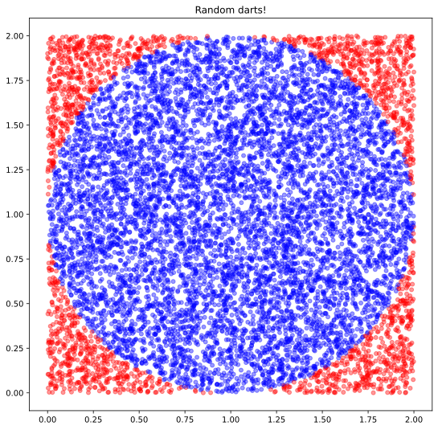

pi can be approximated by throwing darts at a circle in a square, and calculating the ratio of darts landing on the circle vs the square.

## simple way

First, we generate a bunch of throws by using random.random()

We are throwing darts in only the top right quadrant of the square, so the origin is the center of the square, and the diameter of the circle is 2.

We figure out if the points are in the circle by using the pythogeras theorem to calculate the distance of each point from the origin `(0,0)`. If the distance is greater than the radius of the circle, it's outside.
<div class="codecell" markdown="1">
<div class="input_area" markdown="1">

```python
darths_thrown = 10000
throws = [[random.random(), random.random()] for i in range(darths_thrown)]

in_circle=0
out_circle=0

for throw in throws:
    if math.sqrt(throw[0]**2 + throw[1]**2) <= 1:
        in_circle +=1
    else:
        out_circle += 1

pi_estimate = in_circle/len(throws) * 4

print(f'estimate: {pi_estimate}')
print(f'actual: {math.pi}')
print(f'difference is {abs(pi_estimate-math.pi)}')
```

</div>
<div class="output_area" markdown="1">

    estimate: 3.1232
    actual: 3.141592653589793
    difference is 0.018392653589792918


</div>

</div>

## now to jazz this up visually

Putting our random darts in a dataframe to make it easier to eyeball:
<div class="codecell" markdown="1">
<div class="input_area" markdown="1">

```python
df = pd.DataFrame(np.random.rand(darths_thrown,2)*2, columns=["x", "y"])
df.head(2)
```

</div>
<div class="output_area" markdown="1">


<div>
<style scoped>
    .dataframe tbody tr th:only-of-type {
        vertical-align: middle;
    }

    .dataframe tbody tr th {
        vertical-align: top;
    }

    .dataframe thead th {
        text-align: right;
    }
</style>
<table border="1" class="dataframe">
  <thead>
    <tr style="text-align: right;">
      <th></th>
      <th>x</th>
      <th>y</th>
    </tr>
  </thead>
  <tbody>
    <tr>
      <th>0</th>
      <td>1.849016</td>
      <td>0.329357</td>
    </tr>
    <tr>
      <th>1</th>
      <td>0.522901</td>
      <td>1.703207</td>
    </tr>
  </tbody>
</table>
</div>


</div>

</div>

Now to label each darth thrown if its inside or outside the circle:
<div class="codecell" markdown="1">
<div class="input_area" markdown="1">

```python
def is_in_circle(row):
    x = row['x']
    y = row['y']
    if math.sqrt((x-1)**2 + (y-1)**2) <= 1:
        return True
    else:
        return False

df['In_Circle'] = df.apply(is_in_circle, axis=1)
df.head(4)
```

</div>
<div class="output_area" markdown="1">


<div>
<style scoped>
    .dataframe tbody tr th:only-of-type {
        vertical-align: middle;
    }

    .dataframe tbody tr th {
        vertical-align: top;
    }

    .dataframe thead th {
        text-align: right;
    }
</style>
<table border="1" class="dataframe">
  <thead>
    <tr style="text-align: right;">
      <th></th>
      <th>x</th>
      <th>y</th>
      <th>In_Circle</th>
    </tr>
  </thead>
  <tbody>
    <tr>
      <th>0</th>
      <td>1.849016</td>
      <td>0.329357</td>
      <td>False</td>
    </tr>
    <tr>
      <th>1</th>
      <td>0.522901</td>
      <td>1.703207</td>
      <td>True</td>
    </tr>
    <tr>
      <th>2</th>
      <td>1.694082</td>
      <td>1.474200</td>
      <td>True</td>
    </tr>
    <tr>
      <th>3</th>
      <td>1.820643</td>
      <td>1.966332</td>
      <td>False</td>
    </tr>
  </tbody>
</table>
</div>


</div>

</div>

Now to eyeball the random darts, coloured by whether they are in or outside the circle:
<div class="codecell" markdown="1">
<div class="input_area" markdown="1">

```python
fig, ax = plt.subplots(figsize=(9,9))
ax.set_title("Random darts!")
ax.scatter(df['x'], df['y'], c=[within and 'blue' or 'red' for within in df['In_Circle']], alpha=0.4,s= 25);
```

</div>
<div class="output_area" markdown="1">





</div>

</div>

the ratio of the area of the circle divided by the area of the square gives us pi/4:
<div class="codecell" markdown="1">
<div class="input_area" markdown="1">

```python
pi_estimate = df['In_Circle'].sum() / len(df) * 4
pi_estimate
```

</div>
<div class="output_area" markdown="1">


    3.148


</div>

</div>
<div class="codecell" markdown="1">
<div class="input_area" markdown="1">

```python
pi_estimate - math.pi
```

</div>
<div class="output_area" markdown="1">


    0.0064073464102070155


</div>

</div>

So the estimate is pretty close! Neat, since all it took was some very simple maths and a random number generator.
