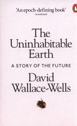

# Book info using python

I want to post my book reviews to this here blog, and to keep it simple, have a script pull up relevant book info. So this here is a exploration of how to to do.


sample book: [The Uninhabitable Earth](https://www.google.com.au/books/edition/The_Uninhabitable_Earth/rNNtDwAAQBAJ?hl=en&gbpv=0)

First up, there are a number of ways to get book info. So trying out a few.


```python
isbn = 9780141988870 # testing isbn number
```

## isbnlib

This seems a reasonably popular isbn lib:
https://github.com/xlcnd/isbnlib

`pip install isbnlib`

isbnlib grabs info from google books by default.


```python
from isbnlib import meta, cover

print(cover(str(isbn)))
meta(str(isbn))
```

    {'smallThumbnail': 'http://books.google.com/books/content?id=248DyAEACAAJ&printsec=frontcover&img=1&zoom=5&source=gbs_api', 'thumbnail': 'http://books.google.com/books/content?id=248DyAEACAAJ&printsec=frontcover&img=1&zoom=1&source=gbs_api'}


    {'ISBN-13': '9780141988870',
     'Title': 'The Uninhabitable Earth - A Story of the Future',
     'Authors': ['David Wallace-Wells'],
     'Publisher': '',
     'Year': '2019',
     'Language': 'un'}


hmmm... this is so simple that I might as well try this directly.

## Google books

Trying out Google books directly


```python
import requests
import matplotlib.pyplot as plt
from PIL import Image
from io import BytesIO
```


```python
def get_book_info(isbn: int):
    api = "https://www.googleapis.com/books/v1/volumes?q=isbn:"
    response = requests.get(f"{api}{isbn}")
    
    # return the first item
    if response:
        all_data = response.json()["items"][0]
    else:
        return False

    return all_data["volumeInfo"]
    #img_url = all_data["volumeInfo"]["imageLinks"]["thumbnail"]
    
data = get_book_info(isbn)
data
```


    {'title': 'The Uninhabitable Earth',
     'subtitle': 'A Story of the Future',
     'authors': ['David Wallace-Wells'],
     'publishedDate': '2019-09-05',
     'description': '**SUNDAY TIMES AND THE NEW YORK TIMES BESTSELLER** \'An epoch-defining book\' Matt Haig \'If you read just one work of non-fiction this year, it should probably be this\' David Sexton, Evening Standard Selected as a Book of the Year 2019 by the Sunday Times, Spectator and New Statesman A Waterstones Paperback of the Year and shortlisted for the Foyles Book of the Year 2019 Longlisted for the PEN / E.O. Wilson Literary Science Writing Award It is worse, much worse, than you think. The slowness of climate change is a fairy tale, perhaps as pernicious as the one that says it isn\'t happening at all, and if your anxiety about it is dominated by fears of sea-level rise, you are barely scratching the surface of what terrors are possible, even within the lifetime of a teenager today. Over the past decades, the term "Anthropocene" has climbed into the popular imagination - a name given to the geologic era we live in now, one defined by human intervention in the life of the planet. But however sanguine you might be about the proposition that we have ravaged the natural world, which we surely have, it is another thing entirely to consider the possibility that we have only provoked it, engineering first in ignorance and then in denial a climate system that will now go to war with us for many centuries, perhaps until it destroys us. In the meantime, it will remake us, transforming every aspect of the way we live-the planet no longer nurturing a dream of abundance, but a living nightmare.',
     'industryIdentifiers': [{'type': 'ISBN_10', 'identifier': '0141988878'},
      {'type': 'ISBN_13', 'identifier': '9780141988870'}],
     'readingModes': {'text': False, 'image': False},
     'pageCount': 320,
     'printType': 'BOOK',
     'categories': ['Climatic changes'],
     'averageRating': 4,
     'ratingsCount': 23,
     'maturityRating': 'NOT_MATURE',
     'allowAnonLogging': False,
     'contentVersion': 'preview-1.0.0',
     'panelizationSummary': {'containsEpubBubbles': False,
      'containsImageBubbles': False},
     'imageLinks': {'smallThumbnail': 'http://books.google.com/books/content?id=248DyAEACAAJ&printsec=frontcover&img=1&zoom=5&source=gbs_api',
      'thumbnail': 'http://books.google.com/books/content?id=248DyAEACAAJ&printsec=frontcover&img=1&zoom=1&source=gbs_api'},
     'language': 'un',
     'previewLink': 'http://books.google.com.au/books?id=248DyAEACAAJ&dq=isbn:9780141988870&hl=&cd=1&source=gbs_api',
     'infoLink': 'http://books.google.com.au/books?id=248DyAEACAAJ&dq=isbn:9780141988870&hl=&source=gbs_api',
     'canonicalVolumeLink': 'https://books.google.com/books/about/The_Uninhabitable_Earth.html?hl=&id=248DyAEACAAJ'}


Now to get the image cover:


```python
def get_image(url: str, path=None):
    """downloads image and returns it
    todo: save to disk if given a filepath"""
    
    r = requests.get(url)
    img = Image.open(BytesIO(r.content))
    
    if path:
        print("save to disk here")
    
    return img

get_image(data["imageLinks"]["thumbnail"])
```


    

    


## Goodreads

Now this is the service I actually want to use, but sadly Goodreads [removed](https://help.goodreads.com/s/article/Does-Goodreads-support-the-use-of-APIs) their [api](https://www.goodreads.com/api) and shows no sign of bringing one back.

So one option is to scape goodreads. I set my prfofile visible to the world, got some url's and...

First trying out pandas to get the reviews table:


```python
from bs4 import BeautifulSoup
from dataclasses import dataclass
import pandas as pd

@dataclass
class gr:
    "stores goodreads urls"
    user = "https://www.goodreads.com/user/show/819075-ko"
    reviews = "https://www.goodreads.com/review/list/819075-ko?order=d&sort=review&view=reviews"
    ratings = "https://www.goodreads.com/review/list/819075-ko?sort=rating&view=reviews"

```


```python
df = pd.read_html(gr.reviews)[1]
df = df[df.columns[2:-1]] # drop unnecessary cols
print(df.shape)
df.iloc[0]
```

    (30, 8)


    title                                title Freedom at Midnight
    author                                   author Collins, Larry
    rating                                         avg rating 4.32
    rating.1                          KO's rating  did not like it
    my rating    my rating  1 of 5 stars2 of 5 stars3 of 5 star...
    review       review  Oh goody, yet another book written thr...
    read                                        date read  not set
    added                                 date added  May 28, 2013
    Name: 0, dtype: object


Pandas doesn't do a great job with the table, so moving on to [beautiful soup](https://www.crummy.com/software/BeautifulSoup/)


```python
r = requests.get(gr.reviews)
soup = BeautifulSoup(r.content, 'html.parser')
```


```python
tables = soup.find_all("table")
```


```python
df = pd.read_html(tables[1].prettify())[0]
df.head()
```


<div>
<style scoped>
    .dataframe tbody tr th:only-of-type {
        vertical-align: middle;
    }

    .dataframe tbody tr th {
        vertical-align: top;
    }

    .dataframe thead th {
        text-align: right;
    }
</style>
<table border="1" class="dataframe">
  <thead>
    <tr style="text-align: right;">
      <th></th>
      <th>Unnamed: 0</th>
      <th>cover</th>
      <th>title</th>
      <th>author</th>
      <th>rating</th>
      <th>rating.1</th>
      <th>my rating</th>
      <th>review</th>
      <th>read</th>
      <th>added</th>
      <th>Unnamed: 10</th>
    </tr>
  </thead>
  <tbody>
    <tr>
      <th>0</th>
      <td>checkbox</td>
      <td>cover</td>
      <td>title  Freedom at Midnight</td>
      <td>author  Collins, Larry</td>
      <td>avg rating  4.32</td>
      <td>KO's rating  did not like it</td>
      <td>my rating  1 of 5 stars  2 of 5 stars  3 of 5 ...</td>
      <td>review  Oh goody, yet another book written thr...</td>
      <td>date read  not set</td>
      <td>date added  May 28, 2013</td>
      <td>actions  view</td>
    </tr>
    <tr>
      <th>1</th>
      <td>checkbox</td>
      <td>cover</td>
      <td>title  Terra Nullius: A Journey Through No One...</td>
      <td>author  Lindqvist, Sven</td>
      <td>avg rating  4.03</td>
      <td>KO's rating  it was amazing</td>
      <td>my rating  1 of 5 stars  2 of 5 stars  3 of 5 ...</td>
      <td>review  A great starting point on Australia, r...</td>
      <td>date read  Aug 27, 2012</td>
      <td>date added  Aug 23, 2012</td>
      <td>actions  view</td>
    </tr>
    <tr>
      <th>2</th>
      <td>checkbox</td>
      <td>cover</td>
      <td>title  Pakistan: A Hard Country</td>
      <td>author  Lieven, Anatol</td>
      <td>avg rating  4.09</td>
      <td>KO's rating  liked it</td>
      <td>my rating  1 of 5 stars  2 of 5 stars  3 of 5 ...</td>
      <td>review  Gets some stuff right, a lot right, bu...</td>
      <td>date read  not set</td>
      <td>date added  May 01, 2011</td>
      <td>actions  view</td>
    </tr>
    <tr>
      <th>3</th>
      <td>checkbox</td>
      <td>cover</td>
      <td>title  Shameful Flight: The Last Years of the ...</td>
      <td>author  Wolpert, Stanley</td>
      <td>avg rating  4.00</td>
      <td>KO's rating  it was amazing</td>
      <td>my rating  1 of 5 stars  2 of 5 stars  3 of 5 ...</td>
      <td>review  Best, most concise history of the inde...</td>
      <td>date read  Mar 02, 2010</td>
      <td>date added  Mar 01, 2010</td>
      <td>actions  view</td>
    </tr>
    <tr>
      <th>4</th>
      <td>checkbox</td>
      <td>cover</td>
      <td>title  Tiamat's Wrath  (The Expanse, #8)</td>
      <td>author  Corey, James S.A.  *</td>
      <td>avg rating  4.56</td>
      <td>KO's rating  liked it</td>
      <td>my rating  1 of 5 stars  2 of 5 stars  3 of 5 ...</td>
      <td>review  Eight books into the series, it's done...</td>
      <td>date read  not set</td>
      <td>date added  Mar 16, 2019</td>
      <td>actions  view</td>
    </tr>
  </tbody>
</table>
</div>


```python
df.iloc[0]
```


    Unnamed: 0                                              checkbox
    cover                                                      cover
    title                                 title  Freedom at Midnight
    author                                    author  Collins, Larry
    rating                                          avg rating  4.32
    rating.1                            KO's rating  did not like it
    my rating      my rating  1 of 5 stars  2 of 5 stars  3 of 5 ...
    review         review  Oh goody, yet another book written thr...
    read                                          date read  not set
    added                                   date added  May 28, 2013
    Unnamed: 10                                        actions  view
    Name: 0, dtype: object


When I look at the source code in the web browser I can see that the entire review is in the table, as well as links to the cover img... so to capture this I need might need a js enabled scraper.

## Scrapy and Selenium

look at:

- https://github.com/OmarEinea/GoodReadsScraper

Using the beta version as the non-beta was last updated in 2018:

Conda doesn't seem to have the beta version so using pip:
`pip install selenium==4.0.0.b4` 

To get the webdriver to run, check the version of chrome installed and install the [same version of the chromedriver](https://chromedriver.chromium.org/downloads).

`pip install "chromedriver_binary==91.0.4472.101"`

If above doesn't work, try the auto binary:
`pip install chromedriver-binary-auto` # install the correct version

If chrome is updated, reinstall by
`pip install --upgrade --force-reinstall chromedriver-binary-auto`

The main table I want has the css id **books** and class **table stacked** and it lazy loads as I scroll down.


```python
from selenium import webdriver
from selenium.webdriver.common.by import By

import chromedriver_binary  # Adds chromedriver binary to path
```


```python
driver = webdriver.Chrome()
driver.get("http://www.python.org")
assert "Python" in driver.title
```

So the basics work, now moving on to using it for goodreads


```python
driver = webdriver.Chrome()
driver.get(gr.reviews)
driver.title
```


    'KO’s books on Goodreads (1,135 books)'


Ok need to come back to this later...


```python
driver.close() # shut the browser when done
```
