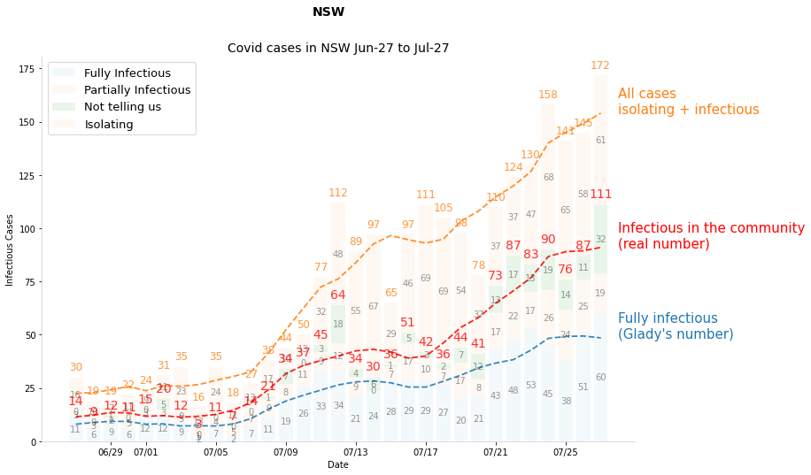
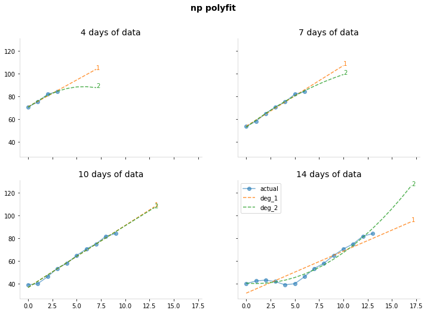
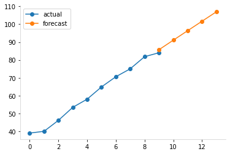
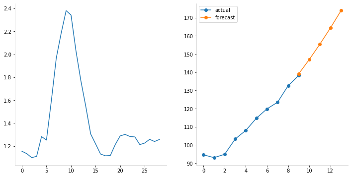
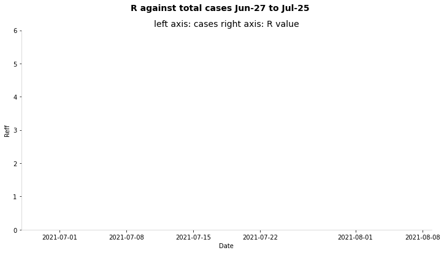

# Covid in NSW, 2021 edition

work in progress, just wanted to see the nsw covid numbers all in one graph.


```python
from datetime import datetime

# viz stuff
import matplotlib.dates as mdates
import matplotlib.pyplot as plt
import numpy as np
import pandas as pd
from matplotlib.dates import DateFormatter
from numpy.polynomial import Polynomial

import plotly.express as px
# import plotly.graph_objects as go
```

## NSW data

https://data.nsw.gov.au/nsw-covid-19-data

### Total covid cases

Modify this to start from first date.

[covidlive](https://covidlive.com.au/report/daily-source-overseas/nsw) gives the total local cases - the **net** column is the local cases only.


```python
def get_total_cases(start_date: str="27 June 2021"):
    """gets total local cases"""
    start_date = pd.to_datetime(start_date, dayfirst=True)
    
    df = pd.read_html("https://covidlive.com.au/report/daily-source-overseas/nsw")[1]

    df.columns = df.columns.str.title()  # hate caps
    df["Date"] = pd.to_datetime(df["Date"], dayfirst=True)  # need dates
    df = df.query("Date >= @start_date")  # only want dates for current spread

    df = df.sort_values(by="Date", ignore_index=True)  # sorted properly

    df = df[["Date", "Net", "Net2"]]
    df = df.rename(columns={"Net": "Local_cases", "Net2": "Overseas_cases"})
    return df

df_total = get_total_cases()
print(df_total.shape)
df_total.tail(3)
```

    (39, 3)


<div>
<style scoped>
    .dataframe tbody tr th:only-of-type {
        vertical-align: middle;
    }

    .dataframe tbody tr th {
        vertical-align: top;
    }

    .dataframe thead th {
        text-align: right;
    }
</style>
<table border="1" class="dataframe">
  <thead>
    <tr style="text-align: right;">
      <th></th>
      <th>Date</th>
      <th>Local_cases</th>
      <th>Overseas_cases</th>
    </tr>
  </thead>
  <tbody>
    <tr>
      <th>36</th>
      <td>2021-08-02</td>
      <td>205</td>
      <td>2</td>
    </tr>
    <tr>
      <th>37</th>
      <td>2021-08-03</td>
      <td>198</td>
      <td>3</td>
    </tr>
    <tr>
      <th>38</th>
      <td>2021-08-04</td>
      <td>233</td>
      <td>1</td>
    </tr>
  </tbody>
</table>
</div>


### Wild Cases


```python
def get_wild_cases():
    """returns df of infectious cases in the community"""
    try:
        df = pd.read_html("https://covidlive.com.au/report/daily-wild-cases/nsw")[1]
    except:
        print(f"something went wrong trying to access the data")
        return False
        
    df.columns = df.columns.str.title()  # hate caps
    df["Date"] = pd.to_datetime(df["Date"], dayfirst=True)  # need dates
    df = df.sort_values(by="Date", ignore_index=True)  # sorted properly
    
    row = df.iloc[-1] 
    if any(row[["Full", "Part", "Unkn"]] == "-"):
        print(f"{row.Date:%d %b} is being updated")
        
    return df

df_wild = get_wild_cases()
print(df_wild.shape)
df_wild.tail(3)
```

    (39, 6)


<div>
<style scoped>
    .dataframe tbody tr th:only-of-type {
        vertical-align: middle;
    }

    .dataframe tbody tr th {
        vertical-align: top;
    }

    .dataframe thead th {
        text-align: right;
    }
</style>
<table border="1" class="dataframe">
  <thead>
    <tr style="text-align: right;">
      <th></th>
      <th>Date</th>
      <th>Full</th>
      <th>Part</th>
      <th>Unkn</th>
      <th>Total</th>
      <th>Iso</th>
    </tr>
  </thead>
  <tbody>
    <tr>
      <th>36</th>
      <td>2021-08-02</td>
      <td>51</td>
      <td>21</td>
      <td>46</td>
      <td>118</td>
      <td>43%</td>
    </tr>
    <tr>
      <th>37</th>
      <td>2021-08-03</td>
      <td>50</td>
      <td>32</td>
      <td>47</td>
      <td>129</td>
      <td>35%</td>
    </tr>
    <tr>
      <th>38</th>
      <td>2021-08-04</td>
      <td>47</td>
      <td>21</td>
      <td>73</td>
      <td>141</td>
      <td>39%</td>
    </tr>
  </tbody>
</table>
</div>


### Final data

This is the dataset I'm using to make graphs prediction etc.

For smoothing, see [this](https://towardsdatascience.com/five-wrong-ways-to-do-covid-19-data-smoothing-1538db6ff182).


```python
def get_data():
    """returns cleaned and joined data"""
    df_wild = get_wild_cases()
    df_total = get_total_cases()
    
    assert df_wild.shape[0] == df_total.shape[0]
    
    df = pd.merge(df_wild, df_total, on=["Date"])
    df["Isolating"] = df.Local_cases - df.Total
    
    # splitting unknown cases by ratio
    ratio = np.mean((df.Full + df.Part) / (df.Local_cases - df.Unkn))
    df["Unkn_inf"] = np.ceil(ratio * df.Unkn)
    df["Unkn_iso"] = df.Unkn - df.Unkn_inf
    
    df["Total_infectious"] = df.Full + df.Part + df.Unkn_inf
    
    # some stats
    for col in ["Full", "Part", "Unkn", "Unkn_inf", 
                "Total_infectious", "Total", "Isolating", "Local_cases"]:
        # exponential weighted avg
        df[f"{col}_ewa"] = df[col].ewm(span=7, adjust=False).mean()

        # rolling mean, though ideally add some forward prediction
        df[f"{col}_roll"] = df[col].rolling(7, center=True, min_periods=4).mean()
    
    return df

df = get_data()
print(df.shape)
df.tail(3)
```

    (39, 28)


<div>
<style scoped>
    .dataframe tbody tr th:only-of-type {
        vertical-align: middle;
    }

    .dataframe tbody tr th {
        vertical-align: top;
    }

    .dataframe thead th {
        text-align: right;
    }
</style>
<table border="1" class="dataframe">
  <thead>
    <tr style="text-align: right;">
      <th></th>
      <th>Date</th>
      <th>Full</th>
      <th>Part</th>
      <th>Unkn</th>
      <th>Total</th>
      <th>Iso</th>
      <th>Local_cases</th>
      <th>Overseas_cases</th>
      <th>Isolating</th>
      <th>Unkn_inf</th>
      <th>...</th>
      <th>Unkn_inf_ewa</th>
      <th>Unkn_inf_roll</th>
      <th>Total_infectious_ewa</th>
      <th>Total_infectious_roll</th>
      <th>Total_ewa</th>
      <th>Total_roll</th>
      <th>Isolating_ewa</th>
      <th>Isolating_roll</th>
      <th>Local_cases_ewa</th>
      <th>Local_cases_roll</th>
    </tr>
  </thead>
  <tbody>
    <tr>
      <th>36</th>
      <td>2021-08-02</td>
      <td>51</td>
      <td>21</td>
      <td>46</td>
      <td>118</td>
      <td>43%</td>
      <td>205</td>
      <td>2</td>
      <td>87</td>
      <td>23.0</td>
      <td>...</td>
      <td>32.001948</td>
      <td>35.833333</td>
      <td>94.362833</td>
      <td>97.00</td>
      <td>127.030620</td>
      <td>134.00</td>
      <td>70.255616</td>
      <td>74.666667</td>
      <td>197.286236</td>
      <td>208.666667</td>
    </tr>
    <tr>
      <th>37</th>
      <td>2021-08-03</td>
      <td>50</td>
      <td>32</td>
      <td>47</td>
      <td>129</td>
      <td>35%</td>
      <td>198</td>
      <td>3</td>
      <td>69</td>
      <td>23.0</td>
      <td>...</td>
      <td>29.751461</td>
      <td>37.800000</td>
      <td>97.022124</td>
      <td>100.80</td>
      <td>127.522965</td>
      <td>139.80</td>
      <td>69.941712</td>
      <td>76.600000</td>
      <td>197.464677</td>
      <td>216.400000</td>
    </tr>
    <tr>
      <th>38</th>
      <td>2021-08-04</td>
      <td>47</td>
      <td>21</td>
      <td>73</td>
      <td>141</td>
      <td>39%</td>
      <td>233</td>
      <td>1</td>
      <td>92</td>
      <td>36.0</td>
      <td>...</td>
      <td>31.313596</td>
      <td>32.500000</td>
      <td>98.766593</td>
      <td>103.25</td>
      <td>130.892224</td>
      <td>136.75</td>
      <td>75.456284</td>
      <td>81.500000</td>
      <td>206.348508</td>
      <td>218.250000</td>
    </tr>
  </tbody>
</table>
<p>3 rows × 28 columns</p>
</div>


## Graphs

First up, to eyeball what is happening


```python
def get_label(col):
    if "_roll" in col:
        col = col.split("_roll")[0]
        
    labels = {
        "Full": "Fully infectious\n(Glady's number)",
        "Part": "Partly infections WTF",
        "Unkn": "Unknown, or we don't know",
        "Unkn_iso": "unkown cases likely isolating",
        "Unkn_inf": "Unknow Infectious in the community\nUnknown cases split by historical ratio",
        "Total_infectious": "Infectious in the community\n(with unknown cases split by historical ratio)",
        "Total": "All infectious + unknown cases",
        "Local_cases": "All cases\nisolating + infectious",
        "Isolating": "iso All cases, isolating + infectious"
    }
    
    return labels[col]
```


```python
fig, ax = plt.subplots(figsize=(12, 8))
fig.suptitle("NSW")
ax.set_title(
    f"Covid cases in NSW {df.Date.min():%b-%d} to {df.Date.max():%b-%d}",
    fontsize=14)

ax.set_ylabel("Infectious Cases")
ax.set_xlabel("Date")

X = df.Date
colors = {}

# draw smoothed lines
cols=["Local_cases", "Total_infectious", "Full"]
for i, col in enumerate(cols[::-1]):
    Y = df[col]
    Y_roll = df[f"{col}_roll"]
    bottom = None if (i-1)<0 else df[cols[i-1]]

    # draw line
    line = ax.plot(X, Y_roll,
        lw=1.8, linestyle="--", alpha=0.88,
        color = "red" if col == "Total_infectious" else None)

    color = line[0].get_color()
    colors[col] = color

    # label line at its end
    xy = X.iloc[-1] + pd.DateOffset(days=1), Y_roll.values[-1]
    ax.annotate(get_label(col), xy=xy, fontsize=15,
                color=color)
    
# color the infectious range
#ax.fill_between(X, df.Total_roll, df.Full_roll + df.Part_roll,
#                alpha=0.15, color="red", hatch="/")

#ax.plot(X, df.Infectious_likely_roll, label="test")
# step
#ax.step(df.Date, df.Total, "o--", alpha=0.35, color=colors["Total"])    

# stacked bar chart
alpha=0.05
full = ax.bar(df.Date, df.Full, label="Fully Infectious", alpha=0.25, color="red")
part = ax.bar(df.Date, df.Part, bottom=df.Full, label="Partially Infectious", 
              alpha=0.25, color="orange")
unkn_inf = ax.bar(df.Date, df.Unkn_inf, bottom=df.Full + df.Part, label="Unknowly Infectious", 
                  color="red", alpha=0.15)
unkn_iso = ax.bar(df.Date, df.Unkn_iso, bottom=df.Total_infectious, label="Unkn Isolating",
           color=colors["Local_cases"], alpha=alpha) # only drawing for labels

iso = ax.bar(df.Date, df.Isolating, bottom=df.Total, label="Isolating",
           color=None, alpha=alpha) # only drawing for labels

#for rect in [full, part, unkn_inf, unkn_iso, iso]: # label the bars in the center
#    ax.bar_label(rect, label_type='center', alpha=0.4)

# label totals by making a invisible total bar
for col in ["Local_cases", "Total_infectious"]:
    r = ax.bar(df.Date, df[col], alpha=0) # only drawing for labels
    ax.bar_label(r, alpha=0.8, padding=5, fontsize=12, color=colors[col])


#ax.bar_label(isolating, alpha=0.8, padding=5, fontsize=12, color=colors["Local_cases"])

# final plot tweaks
date_form = mdates.DateFormatter("%m/%d")
ax.xaxis.set_major_formatter(date_form)
ax.legend(loc="upper left", fontsize=13)


plt.show()
```


    

    


```python
def isolation_ratio():
    ratio = np.mean((df.Full_roll + df.Part_roll) / (df.Local_cases_roll - df.Unkn_roll))
    probable = np.ceil(ratio * df.Isolating_roll)
    
    plt.plot(df.Full_roll + df.Part_roll + probable, label="Infectious")
    plt.legend()
    plt.show()
    
    

isolation_ratio()
    
```


    

    


Now to make a plotly version...


```python
fig = px.bar(df, x="Date", y=["Full", "Part", "Unkn", "Isolating"],
            title="NSW Covid test")

fig
```


<div>                            <div id="1703bd2d-1fee-4d75-8918-d3474c9e1f73" class="plotly-graph-div" style="height:525px; width:100%;"></div>            <script type="text/javascript">                require(["plotly"], function(Plotly) {                    window.PLOTLYENV=window.PLOTLYENV || {};                                    if (document.getElementById("1703bd2d-1fee-4d75-8918-d3474c9e1f73")) {                    Plotly.newPlot(                        "1703bd2d-1fee-4d75-8918-d3474c9e1f73",                        [{"alignmentgroup":"True","hovertemplate":"variable=Full<br>Date=%{x}<br>value=%{y}<extra></extra>","legendgroup":"Full","marker":{"color":"#636efa","pattern":{"shape":""}},"name":"Full","offsetgroup":"Full","orientation":"v","showlegend":true,"textposition":"auto","type":"bar","x":["2021-06-27T00:00:00","2021-06-28T00:00:00","2021-06-29T00:00:00","2021-06-30T00:00:00","2021-07-01T00:00:00","2021-07-02T00:00:00","2021-07-03T00:00:00","2021-07-04T00:00:00","2021-07-05T00:00:00","2021-07-06T00:00:00","2021-07-07T00:00:00","2021-07-08T00:00:00","2021-07-09T00:00:00","2021-07-10T00:00:00","2021-07-11T00:00:00","2021-07-12T00:00:00","2021-07-13T00:00:00","2021-07-14T00:00:00","2021-07-15T00:00:00","2021-07-16T00:00:00","2021-07-17T00:00:00","2021-07-18T00:00:00","2021-07-19T00:00:00","2021-07-20T00:00:00","2021-07-21T00:00:00","2021-07-22T00:00:00","2021-07-23T00:00:00","2021-07-24T00:00:00","2021-07-25T00:00:00","2021-07-26T00:00:00","2021-07-27T00:00:00","2021-07-28T00:00:00","2021-07-29T00:00:00","2021-07-30T00:00:00","2021-07-31T00:00:00","2021-08-01T00:00:00","2021-08-02T00:00:00"],"xaxis":"x","y":[11,6,9,6,12,12,9,2,7,2,7,11,19,26,33,34,21,24,28,29,29,27,20,21,43,48,53,45,38,51,60,46,66,42,21,26,51],"yaxis":"y"},{"alignmentgroup":"True","hovertemplate":"variable=Part<br>Date=%{x}<br>value=%{y}<extra></extra>","legendgroup":"Part","marker":{"color":"#EF553B","pattern":{"shape":""}},"name":"Part","offsetgroup":"Part","orientation":"v","showlegend":true,"textposition":"auto","type":"bar","x":["2021-06-27T00:00:00","2021-06-28T00:00:00","2021-06-29T00:00:00","2021-06-30T00:00:00","2021-07-01T00:00:00","2021-07-02T00:00:00","2021-07-03T00:00:00","2021-07-04T00:00:00","2021-07-05T00:00:00","2021-07-06T00:00:00","2021-07-07T00:00:00","2021-07-08T00:00:00","2021-07-09T00:00:00","2021-07-10T00:00:00","2021-07-11T00:00:00","2021-07-12T00:00:00","2021-07-13T00:00:00","2021-07-14T00:00:00","2021-07-15T00:00:00","2021-07-16T00:00:00","2021-07-17T00:00:00","2021-07-18T00:00:00","2021-07-19T00:00:00","2021-07-20T00:00:00","2021-07-21T00:00:00","2021-07-22T00:00:00","2021-07-23T00:00:00","2021-07-24T00:00:00","2021-07-25T00:00:00","2021-07-26T00:00:00","2021-07-27T00:00:00","2021-07-28T00:00:00","2021-07-29T00:00:00","2021-07-30T00:00:00","2021-07-31T00:00:00","2021-08-01T00:00:00","2021-08-02T00:00:00"],"xaxis":"x","y":[3,3,2,5,3,3,3,1,4,5,7,9,8,11,9,12,9,0,7,17,10,7,17,8,17,22,17,26,24,25,19,22,22,10,11,35,21],"yaxis":"y"},{"alignmentgroup":"True","hovertemplate":"variable=Unkn<br>Date=%{x}<br>value=%{y}<extra></extra>","legendgroup":"Unkn","marker":{"color":"#00cc96","pattern":{"shape":""}},"name":"Unkn","offsetgroup":"Unkn","orientation":"v","showlegend":true,"textposition":"auto","type":"bar","x":["2021-06-27T00:00:00","2021-06-28T00:00:00","2021-06-29T00:00:00","2021-06-30T00:00:00","2021-07-01T00:00:00","2021-07-02T00:00:00","2021-07-03T00:00:00","2021-07-04T00:00:00","2021-07-05T00:00:00","2021-07-06T00:00:00","2021-07-07T00:00:00","2021-07-08T00:00:00","2021-07-09T00:00:00","2021-07-10T00:00:00","2021-07-11T00:00:00","2021-07-12T00:00:00","2021-07-13T00:00:00","2021-07-14T00:00:00","2021-07-15T00:00:00","2021-07-16T00:00:00","2021-07-17T00:00:00","2021-07-18T00:00:00","2021-07-19T00:00:00","2021-07-20T00:00:00","2021-07-21T00:00:00","2021-07-22T00:00:00","2021-07-23T00:00:00","2021-07-24T00:00:00","2021-07-25T00:00:00","2021-07-26T00:00:00","2021-07-27T00:00:00","2021-07-28T00:00:00","2021-07-29T00:00:00","2021-07-30T00:00:00","2021-07-31T00:00:00","2021-08-01T00:00:00","2021-08-02T00:00:00"],"xaxis":"x","y":[0,0,1,0,0,5,0,0,0,0,0,1,7,0,3,18,4,6,1,5,3,2,7,12,13,17,13,19,14,11,32,62,70,53,120,98,46],"yaxis":"y"},{"alignmentgroup":"True","hovertemplate":"variable=Isolating<br>Date=%{x}<br>value=%{y}<extra></extra>","legendgroup":"Isolating","marker":{"color":"#ab63fa","pattern":{"shape":""}},"name":"Isolating","offsetgroup":"Isolating","orientation":"v","showlegend":true,"textposition":"auto","type":"bar","x":["2021-06-27T00:00:00","2021-06-28T00:00:00","2021-06-29T00:00:00","2021-06-30T00:00:00","2021-07-01T00:00:00","2021-07-02T00:00:00","2021-07-03T00:00:00","2021-07-04T00:00:00","2021-07-05T00:00:00","2021-07-06T00:00:00","2021-07-07T00:00:00","2021-07-08T00:00:00","2021-07-09T00:00:00","2021-07-10T00:00:00","2021-07-11T00:00:00","2021-07-12T00:00:00","2021-07-13T00:00:00","2021-07-14T00:00:00","2021-07-15T00:00:00","2021-07-16T00:00:00","2021-07-17T00:00:00","2021-07-18T00:00:00","2021-07-19T00:00:00","2021-07-20T00:00:00","2021-07-21T00:00:00","2021-07-22T00:00:00","2021-07-23T00:00:00","2021-07-24T00:00:00","2021-07-25T00:00:00","2021-07-26T00:00:00","2021-07-27T00:00:00","2021-07-28T00:00:00","2021-07-29T00:00:00","2021-07-30T00:00:00","2021-07-31T00:00:00","2021-08-01T00:00:00","2021-08-02T00:00:00"],"xaxis":"x","y":[16,10,7,11,9,11,23,13,24,11,13,17,10,13,32,48,55,67,29,46,69,69,54,37,37,37,47,68,65,57,61,46,79,65,57,78,87],"yaxis":"y"}],                        {"barmode":"relative","legend":{"title":{"text":"variable"},"tracegroupgap":0},"template":{"data":{"bar":[{"error_x":{"color":"#2a3f5f"},"error_y":{"color":"#2a3f5f"},"marker":{"line":{"color":"#E5ECF6","width":0.5},"pattern":{"fillmode":"overlay","size":10,"solidity":0.2}},"type":"bar"}],"barpolar":[{"marker":{"line":{"color":"#E5ECF6","width":0.5},"pattern":{"fillmode":"overlay","size":10,"solidity":0.2}},"type":"barpolar"}],"carpet":[{"aaxis":{"endlinecolor":"#2a3f5f","gridcolor":"white","linecolor":"white","minorgridcolor":"white","startlinecolor":"#2a3f5f"},"baxis":{"endlinecolor":"#2a3f5f","gridcolor":"white","linecolor":"white","minorgridcolor":"white","startlinecolor":"#2a3f5f"},"type":"carpet"}],"choropleth":[{"colorbar":{"outlinewidth":0,"ticks":""},"type":"choropleth"}],"contour":[{"colorbar":{"outlinewidth":0,"ticks":""},"colorscale":[[0.0,"#0d0887"],[0.1111111111111111,"#46039f"],[0.2222222222222222,"#7201a8"],[0.3333333333333333,"#9c179e"],[0.4444444444444444,"#bd3786"],[0.5555555555555556,"#d8576b"],[0.6666666666666666,"#ed7953"],[0.7777777777777778,"#fb9f3a"],[0.8888888888888888,"#fdca26"],[1.0,"#f0f921"]],"type":"contour"}],"contourcarpet":[{"colorbar":{"outlinewidth":0,"ticks":""},"type":"contourcarpet"}],"heatmap":[{"colorbar":{"outlinewidth":0,"ticks":""},"colorscale":[[0.0,"#0d0887"],[0.1111111111111111,"#46039f"],[0.2222222222222222,"#7201a8"],[0.3333333333333333,"#9c179e"],[0.4444444444444444,"#bd3786"],[0.5555555555555556,"#d8576b"],[0.6666666666666666,"#ed7953"],[0.7777777777777778,"#fb9f3a"],[0.8888888888888888,"#fdca26"],[1.0,"#f0f921"]],"type":"heatmap"}],"heatmapgl":[{"colorbar":{"outlinewidth":0,"ticks":""},"colorscale":[[0.0,"#0d0887"],[0.1111111111111111,"#46039f"],[0.2222222222222222,"#7201a8"],[0.3333333333333333,"#9c179e"],[0.4444444444444444,"#bd3786"],[0.5555555555555556,"#d8576b"],[0.6666666666666666,"#ed7953"],[0.7777777777777778,"#fb9f3a"],[0.8888888888888888,"#fdca26"],[1.0,"#f0f921"]],"type":"heatmapgl"}],"histogram":[{"marker":{"pattern":{"fillmode":"overlay","size":10,"solidity":0.2}},"type":"histogram"}],"histogram2d":[{"colorbar":{"outlinewidth":0,"ticks":""},"colorscale":[[0.0,"#0d0887"],[0.1111111111111111,"#46039f"],[0.2222222222222222,"#7201a8"],[0.3333333333333333,"#9c179e"],[0.4444444444444444,"#bd3786"],[0.5555555555555556,"#d8576b"],[0.6666666666666666,"#ed7953"],[0.7777777777777778,"#fb9f3a"],[0.8888888888888888,"#fdca26"],[1.0,"#f0f921"]],"type":"histogram2d"}],"histogram2dcontour":[{"colorbar":{"outlinewidth":0,"ticks":""},"colorscale":[[0.0,"#0d0887"],[0.1111111111111111,"#46039f"],[0.2222222222222222,"#7201a8"],[0.3333333333333333,"#9c179e"],[0.4444444444444444,"#bd3786"],[0.5555555555555556,"#d8576b"],[0.6666666666666666,"#ed7953"],[0.7777777777777778,"#fb9f3a"],[0.8888888888888888,"#fdca26"],[1.0,"#f0f921"]],"type":"histogram2dcontour"}],"mesh3d":[{"colorbar":{"outlinewidth":0,"ticks":""},"type":"mesh3d"}],"parcoords":[{"line":{"colorbar":{"outlinewidth":0,"ticks":""}},"type":"parcoords"}],"pie":[{"automargin":true,"type":"pie"}],"scatter":[{"marker":{"colorbar":{"outlinewidth":0,"ticks":""}},"type":"scatter"}],"scatter3d":[{"line":{"colorbar":{"outlinewidth":0,"ticks":""}},"marker":{"colorbar":{"outlinewidth":0,"ticks":""}},"type":"scatter3d"}],"scattercarpet":[{"marker":{"colorbar":{"outlinewidth":0,"ticks":""}},"type":"scattercarpet"}],"scattergeo":[{"marker":{"colorbar":{"outlinewidth":0,"ticks":""}},"type":"scattergeo"}],"scattergl":[{"marker":{"colorbar":{"outlinewidth":0,"ticks":""}},"type":"scattergl"}],"scattermapbox":[{"marker":{"colorbar":{"outlinewidth":0,"ticks":""}},"type":"scattermapbox"}],"scatterpolar":[{"marker":{"colorbar":{"outlinewidth":0,"ticks":""}},"type":"scatterpolar"}],"scatterpolargl":[{"marker":{"colorbar":{"outlinewidth":0,"ticks":""}},"type":"scatterpolargl"}],"scatterternary":[{"marker":{"colorbar":{"outlinewidth":0,"ticks":""}},"type":"scatterternary"}],"surface":[{"colorbar":{"outlinewidth":0,"ticks":""},"colorscale":[[0.0,"#0d0887"],[0.1111111111111111,"#46039f"],[0.2222222222222222,"#7201a8"],[0.3333333333333333,"#9c179e"],[0.4444444444444444,"#bd3786"],[0.5555555555555556,"#d8576b"],[0.6666666666666666,"#ed7953"],[0.7777777777777778,"#fb9f3a"],[0.8888888888888888,"#fdca26"],[1.0,"#f0f921"]],"type":"surface"}],"table":[{"cells":{"fill":{"color":"#EBF0F8"},"line":{"color":"white"}},"header":{"fill":{"color":"#C8D4E3"},"line":{"color":"white"}},"type":"table"}]},"layout":{"annotationdefaults":{"arrowcolor":"#2a3f5f","arrowhead":0,"arrowwidth":1},"autotypenumbers":"strict","coloraxis":{"colorbar":{"outlinewidth":0,"ticks":""}},"colorscale":{"diverging":[[0,"#8e0152"],[0.1,"#c51b7d"],[0.2,"#de77ae"],[0.3,"#f1b6da"],[0.4,"#fde0ef"],[0.5,"#f7f7f7"],[0.6,"#e6f5d0"],[0.7,"#b8e186"],[0.8,"#7fbc41"],[0.9,"#4d9221"],[1,"#276419"]],"sequential":[[0.0,"#0d0887"],[0.1111111111111111,"#46039f"],[0.2222222222222222,"#7201a8"],[0.3333333333333333,"#9c179e"],[0.4444444444444444,"#bd3786"],[0.5555555555555556,"#d8576b"],[0.6666666666666666,"#ed7953"],[0.7777777777777778,"#fb9f3a"],[0.8888888888888888,"#fdca26"],[1.0,"#f0f921"]],"sequentialminus":[[0.0,"#0d0887"],[0.1111111111111111,"#46039f"],[0.2222222222222222,"#7201a8"],[0.3333333333333333,"#9c179e"],[0.4444444444444444,"#bd3786"],[0.5555555555555556,"#d8576b"],[0.6666666666666666,"#ed7953"],[0.7777777777777778,"#fb9f3a"],[0.8888888888888888,"#fdca26"],[1.0,"#f0f921"]]},"colorway":["#636efa","#EF553B","#00cc96","#ab63fa","#FFA15A","#19d3f3","#FF6692","#B6E880","#FF97FF","#FECB52"],"font":{"color":"#2a3f5f"},"geo":{"bgcolor":"white","lakecolor":"white","landcolor":"#E5ECF6","showlakes":true,"showland":true,"subunitcolor":"white"},"hoverlabel":{"align":"left"},"hovermode":"closest","mapbox":{"style":"light"},"paper_bgcolor":"white","plot_bgcolor":"#E5ECF6","polar":{"angularaxis":{"gridcolor":"white","linecolor":"white","ticks":""},"bgcolor":"#E5ECF6","radialaxis":{"gridcolor":"white","linecolor":"white","ticks":""}},"scene":{"xaxis":{"backgroundcolor":"#E5ECF6","gridcolor":"white","gridwidth":2,"linecolor":"white","showbackground":true,"ticks":"","zerolinecolor":"white"},"yaxis":{"backgroundcolor":"#E5ECF6","gridcolor":"white","gridwidth":2,"linecolor":"white","showbackground":true,"ticks":"","zerolinecolor":"white"},"zaxis":{"backgroundcolor":"#E5ECF6","gridcolor":"white","gridwidth":2,"linecolor":"white","showbackground":true,"ticks":"","zerolinecolor":"white"}},"shapedefaults":{"line":{"color":"#2a3f5f"}},"ternary":{"aaxis":{"gridcolor":"white","linecolor":"white","ticks":""},"baxis":{"gridcolor":"white","linecolor":"white","ticks":""},"bgcolor":"#E5ECF6","caxis":{"gridcolor":"white","linecolor":"white","ticks":""}},"title":{"x":0.05},"xaxis":{"automargin":true,"gridcolor":"white","linecolor":"white","ticks":"","title":{"standoff":15},"zerolinecolor":"white","zerolinewidth":2},"yaxis":{"automargin":true,"gridcolor":"white","linecolor":"white","ticks":"","title":{"standoff":15},"zerolinecolor":"white","zerolinewidth":2}}},"title":{"text":"NSW Covid test"},"xaxis":{"anchor":"y","domain":[0.0,1.0],"title":{"text":"Date"}},"yaxis":{"anchor":"x","domain":[0.0,1.0],"title":{"text":"value"}}},                        {"responsive": true}                    ).then(function(){

var gd = document.getElementById('1703bd2d-1fee-4d75-8918-d3474c9e1f73');
var x = new MutationObserver(function (mutations, observer) {{
        var display = window.getComputedStyle(gd).display;
        if (!display || display === 'none') {{
            console.log([gd, 'removed!']);
            Plotly.purge(gd);
            observer.disconnect();
        }}
}});

// Listen for the removal of the full notebook cells
var notebookContainer = gd.closest('#notebook-container');
if (notebookContainer) {{
    x.observe(notebookContainer, {childList: true});
}}

// Listen for the clearing of the current output cell
var outputEl = gd.closest('.output');
if (outputEl) {{
    x.observe(outputEl, {childList: true});
}}

                        })                };                });            </script>        </div>


```python
fig.
```

## Extrapolation

Now to use a simple fit to extend cases out 5 days.


```python
from numpy.polynomial import Polynomial
from scipy.optimize import curve_fit
from sklearn import linear_model
```


```python
DEG = 2
DAYS = 10
FORECAST = 5 # num of days to look ahead

fig, axs = plt.subplots(2,2, figsize=(12,8), sharex=True, sharey=True)
fig.suptitle("np polyfit")

for ax, DAYS in zip(axs.flat, [4, 7, 10, 14]):
    y = df.tail(DAYS).Total_roll.values
    x = np.arange(len(y))
    xx = np.arange(max(x)+FORECAST)
    
    ax.set_title(f"{DAYS} days of data")
    ax.plot(x, y, "o-", label="actual", alpha=0.58)
    
    for DEG in [1,2]:
        p = Polynomial.fit(x, y, DEG)
        line = ax.plot(xx, p(xx), "--", label=f"deg_{DEG}", alpha=0.8
                      )
        ax.annotate(f"{DEG}", xy=(xx[-1], p(xx)[-1]), 
                    color=line[0].get_color())
    
ax.legend();
```


    

    


```python
DEG = 2
DAYS = 10
FORECAST = 5 # num of days to look ahead

y = y = df.tail(DAYS).Total_roll.values
x = np.arange(len(y))
xx = np.arange(max(x), max(x)+FORECAST)
p = Polynomial.fit(x, y, DEG)

plt.plot(x, y, "o-", label = "actual")
plt.plot(xx, p(xx), "o-", label="forecast")
plt.legend();
```


    

    


## A simple R calculation


```python
def get_R(col:str = "Total_roll", T=5):
    """col: column to look at
       T: doubling time"""
    
    DEG = 2
    DAYS = 10
    FORECAST = 5 # num of days to look ahead

    y = y = df.tail(DAYS).Local_cases_roll.values
    x = np.arange(len(y))
    xx = np.arange(max(x), max(x)+FORECAST)
    p = Polynomial.fit(x, y, DEG)

    cases = np.concatenate((df[col].values, p(xx)))

    r = (cases[T:] / cases[:-T])
    R = r[-1]
    print(f"R estimate: {R:.2f}")

    fig, (ax, ax1) = plt.subplots(1,2, figsize=(12,6))
    ax.plot(r)
    
    ax1.plot(x, y, "o-", label = "actual")
    ax1.plot(xx, p(xx), "o-", label="forecast")
    ax1.legend()
    plt.show()

    return R

get_R("Local_cases_roll")
```

    R estimate: 1.26


    

    


    1.2580412233938458


```python
def predict(col="Total_roll"):
    start_date = df.Date.iloc[-1]
    end_date = start_date + pd.DateOffset(days=15)
    #end_date = pd.to_datetime("15 December 2021", dayfirst=True)
    x_future = pd.date_range(start_date, end_date, freq=pd.DateOffset(days=1))

    c = df[col].values[-1]
    y_pred = [c * (R**(t/T)) for t in np.arange(1, len(x_future)+1)]
    y_pred[0] = df[col].values[-1] # to make the plot pretty

    y_high = [c * (R*1.2)**(t/T) for t in np.arange(1, len(x_future)+1)]
    y_low = [c * (R*0.80)**(t/T) for t in np.arange(1, len(x_future)+1)]
    print(col, len(x_future), len(y_low), len(y_pred), len(y_high))
    return y_low, y, y_high
    
_ = predict("Total_roll")
```

    Total_roll 16 16 16 16


```python
fig, ax = plt.subplots(figsize=(12, 6))
fig.suptitle(
    f"R against total cases {df.Date.min():%b-%d} to {df.Date.max():%b-%d}")
ax.set_title(
    f"left axis: cases right axis: R value")

ax2.set_ylabel("Infectious Cases")
ax.set_xlabel("Date")
ax.axis(xmin=min(df.Date), xmax=max(x_future))

# plot R on first axis
ax.set_ylim([0,6])
ax.set_ylabel("Reff")
ax.fill_between(df.Date, r, np.zeros_like(r), label="R", alpha=0.07)
ax.legend()

# plot cases on right y axis
ax2 = ax.twinx()
ax2.set_yscale("log")
ax2.set_ylabel("Infectious Cases")

act = ax2.step(df.Date, df.Total, alpha=0.16, color="red", label="Infectious cases")

# smoothing lines
ax2.plot(df.Date, df.Total_roll, label="Infectious cases smoothed",
       linewidth=1.5, linestyle="-", color="red", alpha=0.5)

# projection
for col in ["Total_roll", "Local_cases_roll"]:
    x_future = pd.date_range(start_date, end_date, freq=pd.DateOffset(days=1))
    print(len(x_future))
    y_low, y_pred, y_high = predict(col)
    print(len(x_future), len(y_low), len(y_pred), len(y_high))
    #ax2.plot(x_future, y_pred, "--", color="red", label=f"{col} projection")
    ax2.plot(x_future, y_low, "--", alpha = 0.1)
    ax2.plot(x_future, y_high, "--", alpha = 0.1)
    ax2.fill_between(x_future, y_pred_plus, y_pred_minus, 
                    color="red", alpha=0.05, label="Uncertainity")

ax2.legend();
```


    ---------------------------------------------------------------------------

    TypeError                                 Traceback (most recent call last)

    <ipython-input-688-495e77ab8328> in <module>
         12 ax.set_ylim([0,6])
         13 ax.set_ylabel("Reff")
    ---> 14 ax.fill_between(df.Date, r, np.zeros_like(r), label="R", alpha=0.07)
         15 ax.legend()
         16 


    ~/anaconda3/envs/py39/lib/python3.9/site-packages/matplotlib/__init__.py in inner(ax, data, *args, **kwargs)
       1359     def inner(ax, *args, data=None, **kwargs):
       1360         if data is None:
    -> 1361             return func(ax, *map(sanitize_sequence, args), **kwargs)
       1362 
       1363         bound = new_sig.bind(ax, *args, **kwargs)


    ~/anaconda3/envs/py39/lib/python3.9/site-packages/matplotlib/axes/_axes.py in fill_between(self, x, y1, y2, where, interpolate, step, **kwargs)
       5384     def fill_between(self, x, y1, y2=0, where=None, interpolate=False,
       5385                      step=None, **kwargs):
    -> 5386         return self._fill_between_x_or_y(
       5387             "x", x, y1, y2,
       5388             where=where, interpolate=interpolate, step=step, **kwargs)


    ~/anaconda3/envs/py39/lib/python3.9/site-packages/matplotlib/axes/_axes.py in _fill_between_x_or_y(self, ind_dir, ind, dep1, dep2, where, interpolate, step, **kwargs)
       5290 
       5291         # Handle united data, such as dates
    -> 5292         ind, dep1, dep2 = map(
       5293             ma.masked_invalid, self._process_unit_info(
       5294                 [(ind_dir, ind), (dep_dir, dep1), (dep_dir, dep2)], kwargs))


    ~/anaconda3/envs/py39/lib/python3.9/site-packages/numpy/ma/core.py in masked_invalid(a, copy)
       2363         cls = type(a)
       2364     else:
    -> 2365         condition = ~(np.isfinite(a))
       2366         cls = MaskedArray
       2367     result = a.view(cls)


    TypeError: ufunc 'isfinite' not supported for the input types, and the inputs could not be safely coerced to any supported types according to the casting rule ''safe''


    

    


```python
fig, ax = plt.subplots(figsize=(12, 8))
fig.suptitle("NSW")
ax.set_title(
    f"Covid cases in NSW {df.Date.min():%b-%d} to {df.Date.max():%b-%d}",
    fontsize=14)

ax.set_ylabel("Infectious Cases")
ax.set_xlabel("Date")

X = df.Date
colors = {}

# draw smoothed lines
cols=["Local_cases", "Total", "Full"]
for i, col in enumerate(cols[::-1]):
    Y = df[col]
    Y_roll = df[f"{col}_roll"]
    bottom = None if (i-1)<0 else df[cols[i-1]]

    # draw line
    line = ax.plot(X, Y_roll,
        lw=1.8, linestyle="--", alpha=0.88,
        color = "red" if col == "Total" else None)

    color = line[0].get_color()
    colors[col] = color

    # label line at its end
    xy = X.iloc[-1] + pd.DateOffset(days=1), Y_roll.values[-1]
    ax.annotate(get_label(col), xy=xy, fontsize=15,
                color=color)

# step
#ax.step(df.Date, df.Total, "o--", alpha=0.35, color=colors["Total"])    

# stacked bar chart
alpha=0.05
full = ax.bar(df.Date, df.Full, label="Fully Isolating", alpha=alpha)
part = ax.bar(df.Date, df.Part, bottom=df.Full, label="Partially Isolating", alpha=alpha)
unkn = ax.bar(df.Date, df.Unkn, bottom=df.Full + df.Part, label="Not telling us", alpha=0.1)
isolating = ax.bar(df.Date, df.Isolating, bottom=df.Total, label="Isolating",
           color=colors["Local_cases"], alpha=alpha) # only drawing for labels

for rect in [full, part, unkn, isolating]: # label the bars in the center
    ax.bar_label(rect, label_type='center', alpha=0.4)

# label totals by making a invisible total bar 
r = ax.bar(df.Date, df.Total, alpha=0) # only drawing for labels
ax.bar_label(r, alpha=0.8, padding=5, fontsize=14, color=colors["Total"])

ax.bar_label(isolating, alpha=0.8, padding=5, fontsize=12, color=colors["Local_cases"])


# projection
ax.set_yscale("log")
for col, c in zip(["Total_roll", "Local_cases_roll"], ("red", "orange")):
    x_future = pd.date_range(start_date, end_date, freq=pd.DateOffset(days=1))
    print(len(x_future))
    y_low, y_pred, y_high = predict(col)
    print(col, len(x_future), len(y_low), len(y_pred), len(y_high))
    ax.plot(x_future, y_pred, "--", color="red", label=f"{col} projection")
    ax.plot(x_future, y_low, "--", alpha = 0.1)
    ax.plot(x_future, y_high, "--", alpha = 0.1)
    ax.fill_between(x_future, y_low, y_high, 
                    color=c, alpha=0.02, label="Uncertainity")


# final plot tweaks
date_form = mdates.DateFormatter("%m/%d")
ax.xaxis.set_major_formatter(date_form)
ax.legend(loc="upper left", fontsize=13)


plt.show()
```

    16
    Total_roll 16 16 16 16
    Total_roll 16 16 10 16


    ---------------------------------------------------------------------------

    ValueError                                Traceback (most recent call last)

    <ipython-input-689-21b282b06708> in <module>
         59     y_low, y_pred, y_high = predict(col)
         60     print(col, len(x_future), len(y_low), len(y_pred), len(y_high))
    ---> 61     ax.plot(x_future, y_pred, "--", color="red", label=f"{col} projection")
         62     ax.plot(x_future, y_low, "--", alpha = 0.1)
         63     ax.plot(x_future, y_high, "--", alpha = 0.1)


    ~/anaconda3/envs/py39/lib/python3.9/site-packages/matplotlib/axes/_axes.py in plot(self, scalex, scaley, data, *args, **kwargs)
       1603         """
       1604         kwargs = cbook.normalize_kwargs(kwargs, mlines.Line2D)
    -> 1605         lines = [*self._get_lines(*args, data=data, **kwargs)]
       1606         for line in lines:
       1607             self.add_line(line)


    ~/anaconda3/envs/py39/lib/python3.9/site-packages/matplotlib/axes/_base.py in __call__(self, data, *args, **kwargs)
        313                 this += args[0],
        314                 args = args[1:]
    --> 315             yield from self._plot_args(this, kwargs)
        316 
        317     def get_next_color(self):


    ~/anaconda3/envs/py39/lib/python3.9/site-packages/matplotlib/axes/_base.py in _plot_args(self, tup, kwargs, return_kwargs)
        499 
        500         if x.shape[0] != y.shape[0]:
    --> 501             raise ValueError(f"x and y must have same first dimension, but "
        502                              f"have shapes {x.shape} and {y.shape}")
        503         if x.ndim > 2 or y.ndim > 2:


    ValueError: x and y must have same first dimension, but have shapes (16,) and (10,)


    

    


Note: fix this right now it is way too simple

## SIR Model TODO

This has 4 states:

- S: susceptible
- E: Exposed
- I: Infected
- R: Removed (recovered or dead, assumed to be immune either way)

the states progress: `s -> E -> I -> R`


```python
from scipy.integrate import odeint
```


```python
pop_size = 8.16e6
pop_sydney = 5.36e6
f"NSW: {pop_size:,} Greater Sydney: {pop_sydney:,}"
```


    'NSW: 8,160,000.0 Greater Sydney: 5,360,000.0'


```python
# fixed parameters, from observations in the real world
recovery_rate = 1 / 18   # γ, avg illness duration
infection_rate = 1 / 5.2 # σ, avg incubation period
```


```python
vax_date = pd.to_datetime("15 December 2021", dayfirst=True)
V1 = 0.34
V2 = 0.14

X = pd.date_range(start_date, vax_date, freq=pd.DateOffset(days=1))
```

# Vaccine


```python
df = pd.read_csv("https://vaccinedata.covid19nearme.com.au/data/air.csv")
print(f"{df.shape}")
df.head()
```

    (32, 240)


<div>
<style scoped>
    .dataframe tbody tr th:only-of-type {
        vertical-align: middle;
    }

    .dataframe tbody tr th {
        vertical-align: top;
    }

    .dataframe thead th {
        text-align: right;
    }
</style>
<table border="1" class="dataframe">
  <thead>
    <tr style="text-align: right;">
      <th></th>
      <th>DATE_AS_AT</th>
      <th>AIR_95_PLUS_FIRST_DOSE_COUNT</th>
      <th>AIR_95_PLUS_FIRST_DOSE_PCT</th>
      <th>AIR_95_PLUS_SECOND_DOSE_COUNT</th>
      <th>AIR_95_PLUS_SECOND_DOSE_PCT</th>
      <th>AIR_95_PLUS_FEMALE_PCT</th>
      <th>AIR_95_PLUS_MALE_PCT</th>
      <th>AIR_90_94_FIRST_DOSE_COUNT</th>
      <th>AIR_90_94_FIRST_DOSE_PCT</th>
      <th>AIR_90_94_SECOND_DOSE_COUNT</th>
      <th>...</th>
      <th>AIR_AUS_50_PLUS_SECOND_DOSE_COUNT</th>
      <th>AIR_AUS_50_PLUS_SECOND_DOSE_PCT</th>
      <th>AIR_AUS_50_PLUS_POPULATION</th>
      <th>AIR_AUS_70_PLUS_FIRST_DOSE_COUNT</th>
      <th>AIR_AUS_70_PLUS_FIRST_DOSE_PCT</th>
      <th>AIR_AUS_70_PLUS_SECOND_DOSE_COUNT</th>
      <th>AIR_AUS_70_PLUS_SECOND_DOSE_PCT</th>
      <th>AIR_AUS_70_PLUS_POPULATION</th>
      <th>VALIDATED</th>
      <th>URL</th>
    </tr>
  </thead>
  <tbody>
    <tr>
      <th>0</th>
      <td>2021-06-30</td>
      <td>35527</td>
      <td>67.1</td>
      <td>20311</td>
      <td>38.4</td>
      <td>69.2</td>
      <td>61.8</td>
      <td>112809</td>
      <td>71.2</td>
      <td>47267</td>
      <td>...</td>
      <td>NaN</td>
      <td>NaN</td>
      <td>NaN</td>
      <td>NaN</td>
      <td>NaN</td>
      <td>NaN</td>
      <td>NaN</td>
      <td>NaN</td>
      <td>Y</td>
      <td>https://www.health.gov.au/sites/default/files/...</td>
    </tr>
    <tr>
      <th>1</th>
      <td>2021-07-01</td>
      <td>35706</td>
      <td>67.5</td>
      <td>20643</td>
      <td>39.0</td>
      <td>69.5</td>
      <td>62.1</td>
      <td>113516</td>
      <td>71.7</td>
      <td>48748</td>
      <td>...</td>
      <td>873372.0</td>
      <td>9.98</td>
      <td>8749703.0</td>
      <td>2056873.0</td>
      <td>70.09</td>
      <td>487223.0</td>
      <td>16.60</td>
      <td>2934706.0</td>
      <td>Y</td>
      <td>https://www.health.gov.au/sites/default/files/...</td>
    </tr>
    <tr>
      <th>2</th>
      <td>2021-07-02</td>
      <td>35886</td>
      <td>67.8</td>
      <td>20974</td>
      <td>39.6</td>
      <td>69.8</td>
      <td>62.5</td>
      <td>114158</td>
      <td>72.1</td>
      <td>50057</td>
      <td>...</td>
      <td>920300.0</td>
      <td>10.52</td>
      <td>8749703.0</td>
      <td>2069603.0</td>
      <td>70.52</td>
      <td>516252.0</td>
      <td>17.59</td>
      <td>2934706.0</td>
      <td>Y</td>
      <td>https://www.health.gov.au/sites/default/files/...</td>
    </tr>
    <tr>
      <th>3</th>
      <td>2021-07-03</td>
      <td>35979</td>
      <td>68.0</td>
      <td>21139</td>
      <td>40.0</td>
      <td>70.0</td>
      <td>62.7</td>
      <td>114463</td>
      <td>72.3</td>
      <td>50750</td>
      <td>...</td>
      <td>943860.0</td>
      <td>10.79</td>
      <td>8749703.0</td>
      <td>2074921.0</td>
      <td>70.70</td>
      <td>530572.0</td>
      <td>18.08</td>
      <td>2934706.0</td>
      <td>Y</td>
      <td>https://www.health.gov.au/sites/default/files/...</td>
    </tr>
    <tr>
      <th>4</th>
      <td>2021-07-04</td>
      <td>36030</td>
      <td>68.1</td>
      <td>21211</td>
      <td>40.1</td>
      <td>70.1</td>
      <td>62.8</td>
      <td>114566</td>
      <td>72.3</td>
      <td>50994</td>
      <td>...</td>
      <td>952509.0</td>
      <td>10.89</td>
      <td>8749703.0</td>
      <td>2076737.0</td>
      <td>70.76</td>
      <td>535877.0</td>
      <td>18.26</td>
      <td>2934706.0</td>
      <td>Y</td>
      <td>https://www.health.gov.au/sites/default/files/...</td>
    </tr>
  </tbody>
</table>
<p>5 rows × 240 columns</p>
</div>


```python
df = pd.read_csv("https://covidbaseau.com/vaccinations/download/")
print(f"{df.shape}")
df.head()
```


    ---------------------------------------------------------------------------

    HTTPError                                 Traceback (most recent call last)

    /var/folders/52/11vzrbln5j32pw5j6hqfc3p40000gn/T/ipykernel_12315/1812066370.py in <module>
    ----> 1 df = pd.read_csv("https://covidbaseau.com/vaccinations/download/")
          2 print(f"{df.shape}")
          3 df.head()


    /usr/local/Caskroom/mambaforge/base/envs/py39/lib/python3.9/site-packages/pandas/io/parsers.py in read_csv(filepath_or_buffer, sep, delimiter, header, names, index_col, usecols, squeeze, prefix, mangle_dupe_cols, dtype, engine, converters, true_values, false_values, skipinitialspace, skiprows, skipfooter, nrows, na_values, keep_default_na, na_filter, verbose, skip_blank_lines, parse_dates, infer_datetime_format, keep_date_col, date_parser, dayfirst, cache_dates, iterator, chunksize, compression, thousands, decimal, lineterminator, quotechar, quoting, doublequote, escapechar, comment, encoding, dialect, error_bad_lines, warn_bad_lines, delim_whitespace, low_memory, memory_map, float_precision, storage_options)
        608     kwds.update(kwds_defaults)
        609 
    --> 610     return _read(filepath_or_buffer, kwds)
        611 
        612 


    /usr/local/Caskroom/mambaforge/base/envs/py39/lib/python3.9/site-packages/pandas/io/parsers.py in _read(filepath_or_buffer, kwds)
        460 
        461     # Create the parser.
    --> 462     parser = TextFileReader(filepath_or_buffer, **kwds)
        463 
        464     if chunksize or iterator:


    /usr/local/Caskroom/mambaforge/base/envs/py39/lib/python3.9/site-packages/pandas/io/parsers.py in __init__(self, f, engine, **kwds)
        817             self.options["has_index_names"] = kwds["has_index_names"]
        818 
    --> 819         self._engine = self._make_engine(self.engine)
        820 
        821     def close(self):


    /usr/local/Caskroom/mambaforge/base/envs/py39/lib/python3.9/site-packages/pandas/io/parsers.py in _make_engine(self, engine)
       1048             )
       1049         # error: Too many arguments for "ParserBase"
    -> 1050         return mapping[engine](self.f, **self.options)  # type: ignore[call-arg]
       1051 
       1052     def _failover_to_python(self):


    /usr/local/Caskroom/mambaforge/base/envs/py39/lib/python3.9/site-packages/pandas/io/parsers.py in __init__(self, src, **kwds)
       1865 
       1866         # open handles
    -> 1867         self._open_handles(src, kwds)
       1868         assert self.handles is not None
       1869         for key in ("storage_options", "encoding", "memory_map", "compression"):


    /usr/local/Caskroom/mambaforge/base/envs/py39/lib/python3.9/site-packages/pandas/io/parsers.py in _open_handles(self, src, kwds)
       1360         Let the readers open IOHanldes after they are done with their potential raises.
       1361         """
    -> 1362         self.handles = get_handle(
       1363             src,
       1364             "r",


    /usr/local/Caskroom/mambaforge/base/envs/py39/lib/python3.9/site-packages/pandas/io/common.py in get_handle(path_or_buf, mode, encoding, compression, memory_map, is_text, errors, storage_options)
        556 
        557     # open URLs
    --> 558     ioargs = _get_filepath_or_buffer(
        559         path_or_buf,
        560         encoding=encoding,


    /usr/local/Caskroom/mambaforge/base/envs/py39/lib/python3.9/site-packages/pandas/io/common.py in _get_filepath_or_buffer(filepath_or_buffer, encoding, compression, mode, storage_options)
        287                 "storage_options passed with file object or non-fsspec file path"
        288             )
    --> 289         req = urlopen(filepath_or_buffer)
        290         content_encoding = req.headers.get("Content-Encoding", None)
        291         if content_encoding == "gzip":


    /usr/local/Caskroom/mambaforge/base/envs/py39/lib/python3.9/site-packages/pandas/io/common.py in urlopen(*args, **kwargs)
        193     import urllib.request
        194 
    --> 195     return urllib.request.urlopen(*args, **kwargs)
        196 
        197 


    /usr/local/Caskroom/mambaforge/base/envs/py39/lib/python3.9/urllib/request.py in urlopen(url, data, timeout, cafile, capath, cadefault, context)
        212     else:
        213         opener = _opener
    --> 214     return opener.open(url, data, timeout)
        215 
        216 def install_opener(opener):


    /usr/local/Caskroom/mambaforge/base/envs/py39/lib/python3.9/urllib/request.py in open(self, fullurl, data, timeout)
        521         for processor in self.process_response.get(protocol, []):
        522             meth = getattr(processor, meth_name)
    --> 523             response = meth(req, response)
        524 
        525         return response


    /usr/local/Caskroom/mambaforge/base/envs/py39/lib/python3.9/urllib/request.py in http_response(self, request, response)
        630         # request was successfully received, understood, and accepted.
        631         if not (200 <= code < 300):
    --> 632             response = self.parent.error(
        633                 'http', request, response, code, msg, hdrs)
        634 


    /usr/local/Caskroom/mambaforge/base/envs/py39/lib/python3.9/urllib/request.py in error(self, proto, *args)
        559         if http_err:
        560             args = (dict, 'default', 'http_error_default') + orig_args
    --> 561             return self._call_chain(*args)
        562 
        563 # XXX probably also want an abstract factory that knows when it makes


    /usr/local/Caskroom/mambaforge/base/envs/py39/lib/python3.9/urllib/request.py in _call_chain(self, chain, kind, meth_name, *args)
        492         for handler in handlers:
        493             func = getattr(handler, meth_name)
    --> 494             result = func(*args)
        495             if result is not None:
        496                 return result


    /usr/local/Caskroom/mambaforge/base/envs/py39/lib/python3.9/urllib/request.py in http_error_default(self, req, fp, code, msg, hdrs)
        639 class HTTPDefaultErrorHandler(BaseHandler):
        640     def http_error_default(self, req, fp, code, msg, hdrs):
    --> 641         raise HTTPError(req.full_url, code, msg, hdrs, fp)
        642 
        643 class HTTPRedirectHandler(BaseHandler):


    HTTPError: HTTP Error 403: Forbidden


```python

```
