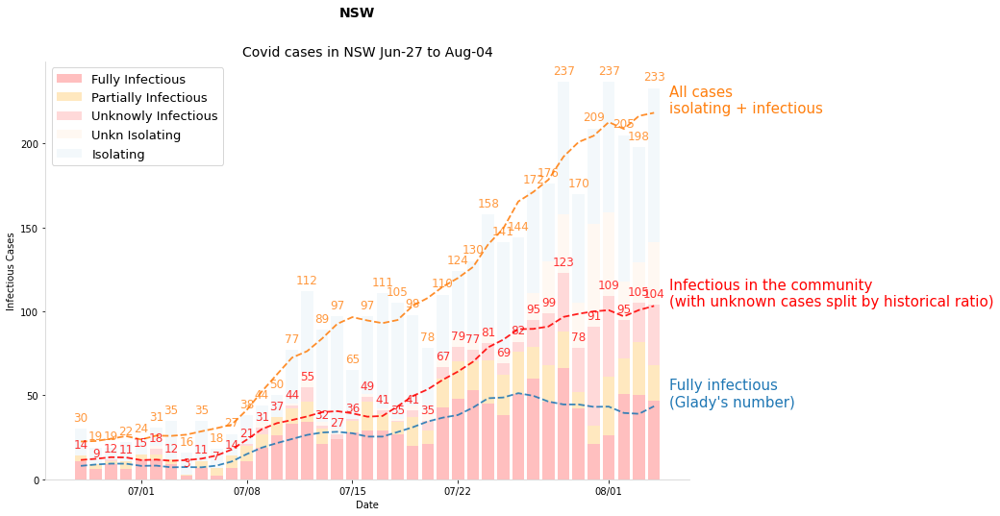
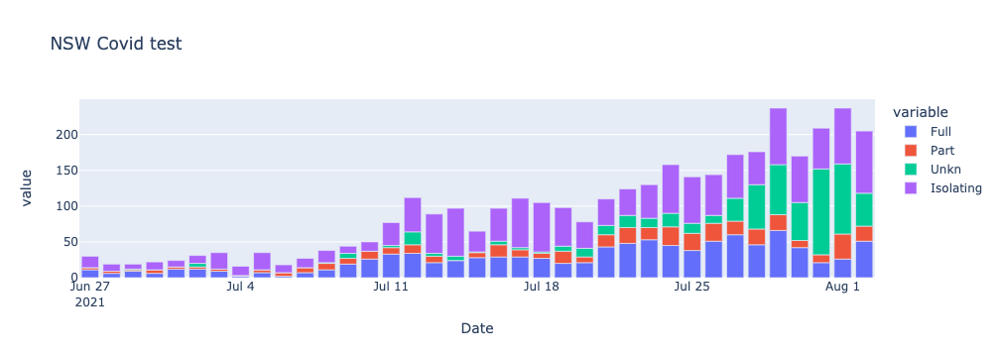
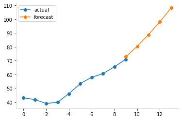
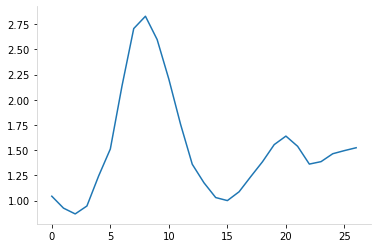
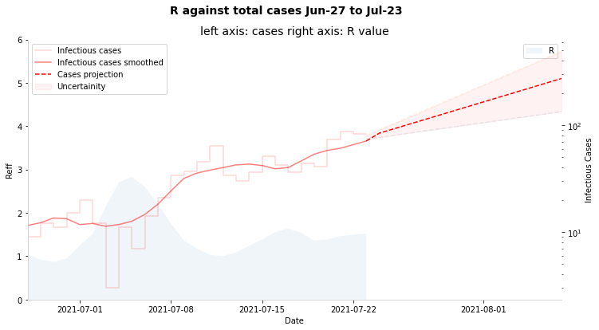

# Covid in NSW, 2021 edition

work in progress, this is basi


```python
import datetime

# viz stuff
import matplotlib.dates as mdates
import matplotlib.pyplot as plt
import numpy as np
import pandas as pd
from matplotlib.dates import DateFormatter
from numpy.polynomial import Polynomial

# import plotly.express as px
# import plotly.graph_objects as go
```

## NSW data

https://data.nsw.gov.au/nsw-covid-19-data

### Total covid cases

Modify this to start from first date.

[covidlive](https://covidlive.com.au/report/daily-source-overseas/nsw) gives the total local cases - the **net** column is the local cases only.


```python
def get_total_cases(start_date: str="27 June 2021"):
    """gets total local cases"""
    start_date = pd.to_datetime(start_date, dayfirst=True)
    
    df = pd.read_html("https://covidlive.com.au/report/daily-source-overseas/nsw")[1]

    df.columns = df.columns.str.title()  # hate caps
    df["Date"] = pd.to_datetime(df["Date"], dayfirst=True)  # need dates
    df = df.query("Date >= @start_date")  # only want dates for current spread

    df = df.sort_values(by="Date", ignore_index=True)  # sorted properly

    df = df[["Date", "Net", "Net2"]]
    df = df.rename(columns={"Net": "Local_cases", "Net2": "Overseas_cases"})
    return df

df_total = get_total_cases()
print(df_total.shape)
df_total.tail(3)
```

    (27, 3)


<div>
<style scoped>
    .dataframe tbody tr th:only-of-type {
        vertical-align: middle;
    }

    .dataframe tbody tr th {
        vertical-align: top;
    }

    .dataframe thead th {
        text-align: right;
    }
</style>
<table border="1" class="dataframe">
  <thead>
    <tr style="text-align: right;">
      <th></th>
      <th>Date</th>
      <th>Local_cases</th>
      <th>Overseas_cases</th>
    </tr>
  </thead>
  <tbody>
    <tr>
      <th>24</th>
      <td>2021-07-21</td>
      <td>110</td>
      <td>2</td>
    </tr>
    <tr>
      <th>25</th>
      <td>2021-07-22</td>
      <td>124</td>
      <td>0</td>
    </tr>
    <tr>
      <th>26</th>
      <td>2021-07-23</td>
      <td>136</td>
      <td>5</td>
    </tr>
  </tbody>
</table>
</div>


### Wild Cases


```python
def get_wild_cases():
    """returns df of infectious cases in the community"""
    try:
        df = pd.read_html("https://covidlive.com.au/report/daily-wild-cases/nsw")[1]
    except:
        print(f"something went wrong trying to access the data")
        return False
        
    df.columns = df.columns.str.title()  # hate caps
    df["Date"] = pd.to_datetime(df["Date"], dayfirst=True)  # need dates
    df = df.sort_values(by="Date", ignore_index=True)  # sorted properly
    
    row = df.iloc[-1] 
    if any(row[["Full", "Part", "Unkn"]] == "-"):
        print(f"{row.Date:%d %b} is being updated")
        
    return df


df_wild = get_wild_cases()
print(df_wild.shape)
df_wild.tail(3)
```

    (27, 6)


<div>
<style scoped>
    .dataframe tbody tr th:only-of-type {
        vertical-align: middle;
    }

    .dataframe tbody tr th {
        vertical-align: top;
    }

    .dataframe thead th {
        text-align: right;
    }
</style>
<table border="1" class="dataframe">
  <thead>
    <tr style="text-align: right;">
      <th></th>
      <th>Date</th>
      <th>Full</th>
      <th>Part</th>
      <th>Unkn</th>
      <th>Total</th>
      <th>Iso</th>
    </tr>
  </thead>
  <tbody>
    <tr>
      <th>24</th>
      <td>2021-07-21</td>
      <td>43</td>
      <td>17</td>
      <td>13</td>
      <td>73</td>
      <td>34%</td>
    </tr>
    <tr>
      <th>25</th>
      <td>2021-07-22</td>
      <td>48</td>
      <td>22</td>
      <td>17</td>
      <td>87</td>
      <td>30%</td>
    </tr>
    <tr>
      <th>26</th>
      <td>2021-07-23</td>
      <td>53</td>
      <td>17</td>
      <td>13</td>
      <td>83</td>
      <td>39%</td>
    </tr>
  </tbody>
</table>
</div>


### Final data

This is the dataset I'm using to make graphs prediction etc.

For smoothing, see [this](https://towardsdatascience.com/five-wrong-ways-to-do-covid-19-data-smoothing-1538db6ff182).


```python
def get_data():
    """returns cleaned and joined data"""
    df_wild = get_wild_cases()
    df_total = get_total_cases()
    
    assert df_wild.shape[0] == df_total.shape[0]
    
    df = pd.merge(df_wild, df_total, on=["Date"])
    df["Isolating"] = df.Local_cases - df.Total
    
    # some stats
    for col in ["Full", "Part", "Unkn", "Total", "Isolating", "Local_cases"]:
        # exponential weighted avg
        df[f"{col}_ewa"] = df[col].ewm(span=7, adjust=False).mean()

        # rolling mean, though ideally add some forward prediction
        df[f"{col}_roll"] = df[col].rolling(7, center=True, min_periods=4).mean()
        
    return df

df = get_data()
print(df.shape)
df.tail(3)
```

    (27, 21)


<div>
<style scoped>
    .dataframe tbody tr th:only-of-type {
        vertical-align: middle;
    }

    .dataframe tbody tr th {
        vertical-align: top;
    }

    .dataframe thead th {
        text-align: right;
    }
</style>
<table border="1" class="dataframe">
  <thead>
    <tr style="text-align: right;">
      <th></th>
      <th>Date</th>
      <th>Full</th>
      <th>Part</th>
      <th>Unkn</th>
      <th>Total</th>
      <th>Iso</th>
      <th>Local_cases</th>
      <th>Overseas_cases</th>
      <th>Isolating</th>
      <th>Full_ewa</th>
      <th>...</th>
      <th>Part_ewa</th>
      <th>Part_roll</th>
      <th>Unkn_ewa</th>
      <th>Unkn_roll</th>
      <th>Total_ewa</th>
      <th>Total_roll</th>
      <th>Isolating_ewa</th>
      <th>Isolating_roll</th>
      <th>Local_cases_ewa</th>
      <th>Local_cases_roll</th>
    </tr>
  </thead>
  <tbody>
    <tr>
      <th>24</th>
      <td>2021-07-21</td>
      <td>43</td>
      <td>17</td>
      <td>13</td>
      <td>73</td>
      <td>34%</td>
      <td>110</td>
      <td>2</td>
      <td>37</td>
      <td>28.642206</td>
      <td>...</td>
      <td>11.877540</td>
      <td>14.666667</td>
      <td>8.021302</td>
      <td>10.666667</td>
      <td>48.541048</td>
      <td>60.666667</td>
      <td>46.076770</td>
      <td>47.833333</td>
      <td>94.617817</td>
      <td>108.5</td>
    </tr>
    <tr>
      <th>25</th>
      <td>2021-07-22</td>
      <td>48</td>
      <td>22</td>
      <td>17</td>
      <td>87</td>
      <td>30%</td>
      <td>124</td>
      <td>0</td>
      <td>37</td>
      <td>33.481654</td>
      <td>...</td>
      <td>14.408155</td>
      <td>16.200000</td>
      <td>10.265976</td>
      <td>12.400000</td>
      <td>58.155786</td>
      <td>65.600000</td>
      <td>43.807577</td>
      <td>43.600000</td>
      <td>101.963363</td>
      <td>109.2</td>
    </tr>
    <tr>
      <th>26</th>
      <td>2021-07-23</td>
      <td>53</td>
      <td>17</td>
      <td>13</td>
      <td>83</td>
      <td>39%</td>
      <td>136</td>
      <td>5</td>
      <td>53</td>
      <td>38.361241</td>
      <td>...</td>
      <td>15.056116</td>
      <td>16.000000</td>
      <td>10.949482</td>
      <td>13.750000</td>
      <td>64.366839</td>
      <td>71.000000</td>
      <td>46.105683</td>
      <td>41.000000</td>
      <td>110.472522</td>
      <td>112.0</td>
    </tr>
  </tbody>
</table>
<p>3 rows × 21 columns</p>
</div>


## Graphs

First up, to eyeball what is happening


```python
def get_label(col):
    if "_roll" in col:
        col = col.split("_roll")[0]
        
    labels = {
        "Full": "Fully infectious\n(Glady's number)",
        "Part": "Partly infections WTF",
        "Unkn": "Unknown, or we don't know",
        "Total": "Infectious in the community\n(real number)",
        "Local_cases": "All cases\nisolating + infectious",
        "Isolating": "iso All cases, isolating + infectious"
    }
    
    return labels[col]
```


```python
fig, ax = plt.subplots(figsize=(12, 8))
fig.suptitle("NSW")
ax.set_title(
    f"Covid cases in NSW {df.Date.min():%b-%d} to {df.Date.max():%b-%d}",
    fontsize=14)

ax.set_ylabel("Infectious Cases")
ax.set_xlabel("Date")

X = df.Date
colors = {}

# draw smoothed lines
cols=["Local_cases", "Total", "Full"]
for i, col in enumerate(cols[::-1]):
    Y = df[col]
    Y_roll = df[f"{col}_roll"]
    bottom = None if (i-1)<0 else df[cols[i-1]]

    # draw line
    line = ax.plot(X, Y_roll,
        lw=1.8, linestyle="--", alpha=0.88,
        color = "red" if col == "Total" else None)

    color = line[0].get_color()
    colors[col] = color

    # label line at its end
    xy = X.iloc[-1] + pd.DateOffset(days=1), Y_roll.values[-1]
    ax.annotate(get_label(col), xy=xy, fontsize=15,
                color=color)

# step
#ax.step(df.Date, df.Total, "o--", alpha=0.35, color=colors["Total"])    

# stacked bar chart
alpha=0.05
full = ax.bar(df.Date, df.Full, label="Fully Isolating", alpha=alpha)
part = ax.bar(df.Date, df.Part, bottom=df.Full, label="Partially Isolating", alpha=alpha)
unkn = ax.bar(df.Date, df.Unkn, bottom=df.Full + df.Part, label="Not telling us", alpha=0.1)
isolating = ax.bar(df.Date, df.Isolating, bottom=df.Total, label="Isolating",
           color=colors["Local_cases"], alpha=alpha) # only drawing for labels

for rect in [full, part, unkn, isolating]: # label the bars in the center
    ax.bar_label(rect, label_type='center', alpha=0.4)

# label totals by making a invisible total bar 
r = ax.bar(df.Date, df.Total, alpha=0) # only drawing for labels
ax.bar_label(r, alpha=0.8, padding=5, fontsize=14, color=colors["Total"])

ax.bar_label(isolating, alpha=0.8, padding=5, fontsize=12, color=colors["Local_cases"])

# final plot tweaks
date_form = mdates.DateFormatter("%m/%d")
ax.xaxis.set_major_formatter(date_form)
ax.legend(loc="upper left", fontsize=13)


plt.show()
```


    

    


## Extrapolation

Now to use a simple fit to extend cases out 5 days.


```python
from numpy.polynomial import Polynomial
from scipy.optimize import curve_fit
from sklearn import linear_model
```


```python
DEG = 2
DAYS = 10
FORECAST = 5 # num of days to look ahead

fig, axs = plt.subplots(2,2, figsize=(12,8), sharex=True, sharey=True)
fig.suptitle("np polyfit")

for ax, DAYS in zip(axs.flat, [4, 7, 10, 14]):
    y = df.tail(DAYS).Total_roll.values
    x = np.arange(len(y))
    xx = np.arange(max(x)+FORECAST)
    
    ax.set_title(f"{DAYS} days of data")
    ax.plot(x, y, "o-", label="actual", alpha=0.58)
    
    for DEG in [1,2]:
        p = Polynomial.fit(x, y, DEG)
        line = ax.plot(xx, p(xx), "--", label=f"deg_{DEG}", alpha=0.8
                      )
        ax.annotate(f"{DEG}", xy=(xx[-1], p(xx)[-1]), 
                    color=line[0].get_color())
    
ax.legend();
```


    

    


```python
DEG = 2
DAYS = 10
FORECAST = 5 # num of days to look ahead

y = y = df.tail(DAYS).Total_roll.values
x = np.arange(len(y))
xx = np.arange(max(x), max(x)+FORECAST)
p = Polynomial.fit(x, y, DEG)

plt.plot(x, y, "o-", label = "actual")
plt.plot(xx, p(xx), "o-", label="forecast")
plt.legend();
```


    

    


## A simple R calculation


```python
cases = np.concatenate((df.Total_roll.values, p(xx)))
```


```python
T = 5 # doubling time

r = (cases[T:] / cases[:-T])
R = r[-1]
print(f"R estimate: {R:.2f}")
plt.plot(r);
```

    R estimate: 1.52


    

    


To project forwards from R, a super simple thingamajig:


```python
start_date = df.Date.iloc[-1]
end_date = start_date + pd.DateOffset(days=15)
#end_date = pd.to_datetime("15 December 2021", dayfirst=True)
x_future = pd.date_range(start_date, end_date, freq=pd.DateOffset(days=1))

c = df.Total_roll.values[-1]
y_pred = [c * (R**(t/T)) for t in np.arange(1, len(x_future)+1)]
y_pred[0] = df.Total_roll.values[-1] # to make the plot pretty

y_pred_plus = [c * (R*1.2)**(t/T) for t in np.arange(1, len(x_future)+1)]
y_pred_minus = [c * (R*0.80)**(t/T) for t in np.arange(1, len(x_future)+1)]
```


```python
fig, ax = plt.subplots(figsize=(12, 6))
fig.suptitle(
    f"R against total cases {df.Date.min():%b-%d} to {df.Date.max():%b-%d}")
ax.set_title(
    f"left axis: cases right axis: R value")

ax2.set_ylabel("Infectious Cases")
ax.set_xlabel("Date")
ax.axis(xmin=min(df.Date), xmax=max(x_future))

# plot R on first axis
ax.set_ylim([0,6])
ax.set_ylabel("Reff")
ax.fill_between(df.Date, r, np.zeros_like(r), label="R", alpha=0.07)
ax.legend()

# plot cases on right y axis
ax2 = ax.twinx()
ax2.set_yscale("log")
ax2.set_ylabel("Infectious Cases")

act = ax2.step(df.Date, df.Total, alpha=0.16, color="red", label="Infectious cases")

# smoothing lines
ax2.plot(df.Date, df.Total_roll, label="Infectious cases smoothed",
       linewidth=1.5, linestyle="-", color="red", alpha=0.5)

# projection
ax2.plot(x_future, y_pred, "--", color="red", label="Cases projection")
ax2.plot(x_future, y_pred_minus, "--", alpha = 0.1)
ax2.plot(x_future, y_pred_plus, "--", alpha = 0.1)
ax2.fill_between(x_future, y_pred_plus, y_pred_minus, 
                color="red", alpha=0.05, label="Uncertainity")

ax2.legend();
```


    

    


Note: fix this right now it is way too simple

## SIR Model TODO

This has 4 states:

- S: susceptible
- E: Exposed
- I: Infected
- R: Removed (recovered or dead, assumed to be immune either way)

the states progress: `s -> E -> I -> R`


```python
from scipy.integrate import odeint
```


```python
pop_size = 8.16e6
pop_sydney = 5.36e6
f"NSW: {pop_size:,} Greater Sydney: {pop_sydney:,}"
```


    'NSW: 8,160,000.0 Greater Sydney: 5,360,000.0'


```python
# fixed parameters, from observations in the real world
recovery_rate = 1 / 18   # γ, avg illness duration
infection_rate = 1 / 5.2 # σ, avg incubation period
```


```python
vax_date = pd.to_datetime("15 December 2021", dayfirst=True)
V1 = 0.34
V2 = 0.14

X = pd.date_range(start_date, vax_date, freq=pd.DateOffset(days=1))
```
