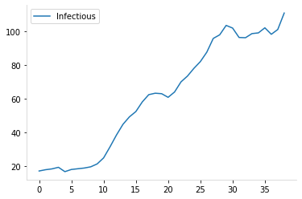

# Covid in NSW, 2021 edition

work in progress, just wanted to see the nsw covid numbers all in one graph.


```python
import datetime

# viz stuff
import matplotlib.dates as mdates
import matplotlib.pyplot as plt
import numpy as np
import pandas as pd
from matplotlib.dates import DateFormatter
from numpy.polynomial import Polynomial

# import plotly.express as px
# import plotly.graph_objects as go
```

## NSW data

https://data.nsw.gov.au/nsw-covid-19-data

### Total covid cases

Modify this to start from first date.

[covidlive](https://covidlive.com.au/report/daily-source-overseas/nsw) gives the total local cases - the **net** column is the local cases only.


```python
def get_total_cases(start_date: str="27 June 2021"):
    """gets total local cases"""
    start_date = pd.to_datetime(start_date, dayfirst=True)
    
    df = pd.read_html("https://covidlive.com.au/report/daily-source-overseas/nsw")[1]

    df.columns = df.columns.str.title()  # hate caps
    df["Date"] = pd.to_datetime(df["Date"], dayfirst=True)  # need dates
    df = df.query("Date >= @start_date")  # only want dates for current spread

    df = df.sort_values(by="Date", ignore_index=True)  # sorted properly

    df = df[["Date", "Net", "Net2"]]
    df = df.rename(columns={"Net": "Local_cases", "Net2": "Overseas_cases"})
    return df

df_total = get_total_cases()
print(df_total.shape)
df_total.tail(3)
```

    (31, 3)


<div>
<style scoped>
    .dataframe tbody tr th:only-of-type {
        vertical-align: middle;
    }

    .dataframe tbody tr th {
        vertical-align: top;
    }

    .dataframe thead th {
        text-align: right;
    }
</style>
<table border="1" class="dataframe">
  <thead>
    <tr style="text-align: right;">
      <th></th>
      <th>Date</th>
      <th>Local_cases</th>
      <th>Overseas_cases</th>
    </tr>
  </thead>
  <tbody>
    <tr>
      <th>28</th>
      <td>2021-07-25</td>
      <td>141</td>
      <td>0</td>
    </tr>
    <tr>
      <th>29</th>
      <td>2021-07-26</td>
      <td>145</td>
      <td>6</td>
    </tr>
    <tr>
      <th>30</th>
      <td>2021-07-27</td>
      <td>172</td>
      <td>3</td>
    </tr>
  </tbody>
</table>
</div>


### Wild Cases


```python
from datetime import datetime
```


```python
def get_wild_cases():
    """returns df of infectious cases in the community"""
    try:
        df = pd.read_html("https://covidlive.com.au/report/daily-wild-cases/nsw")[1]
    except:
        print(f"something went wrong trying to access the data")
        return False
        
    df.columns = df.columns.str.title()  # hate caps
    df["Date"] = pd.to_datetime(df["Date"], dayfirst=True)  # need dates
    df = df.sort_values(by="Date", ignore_index=True)  # sorted properly
    
    row = df.iloc[-1] 
    if any(row[["Full", "Part", "Unkn"]] == "-"):
        print(f"{row.Date:%d %b} is being updated")
        
    return df

df_wild = get_wild_cases()
print(df_wild.shape)
df_wild.tail(3)
```

    (31, 6)


<div>
<style scoped>
    .dataframe tbody tr th:only-of-type {
        vertical-align: middle;
    }

    .dataframe tbody tr th {
        vertical-align: top;
    }

    .dataframe thead th {
        text-align: right;
    }
</style>
<table border="1" class="dataframe">
  <thead>
    <tr style="text-align: right;">
      <th></th>
      <th>Date</th>
      <th>Full</th>
      <th>Part</th>
      <th>Unkn</th>
      <th>Total</th>
      <th>Iso</th>
    </tr>
  </thead>
  <tbody>
    <tr>
      <th>28</th>
      <td>2021-07-25</td>
      <td>38</td>
      <td>24</td>
      <td>14</td>
      <td>76</td>
      <td>46%</td>
    </tr>
    <tr>
      <th>29</th>
      <td>2021-07-26</td>
      <td>51</td>
      <td>25</td>
      <td>11</td>
      <td>87</td>
      <td>40%</td>
    </tr>
    <tr>
      <th>30</th>
      <td>2021-07-27</td>
      <td>60</td>
      <td>19</td>
      <td>32</td>
      <td>111</td>
      <td>35%</td>
    </tr>
  </tbody>
</table>
</div>


### Final data

This is the dataset I'm using to make graphs prediction etc.

For smoothing, see [this](https://towardsdatascience.com/five-wrong-ways-to-do-covid-19-data-smoothing-1538db6ff182).


```python
def get_data():
    """returns cleaned and joined data"""
    df_wild = get_wild_cases()
    df_total = get_total_cases()
    
    assert df_wild.shape[0] == df_total.shape[0]
    
    df = pd.merge(df_wild, df_total, on=["Date"])
    df["Isolating"] = df.Local_cases - df.Total
    
    # some stats
    for col in ["Full", "Part", "Unkn", "Total", "Isolating", "Local_cases"]:
        # exponential weighted avg
        df[f"{col}_ewa"] = df[col].ewm(span=7, adjust=False).mean()

        # rolling mean, though ideally add some forward prediction
        df[f"{col}_roll"] = df[col].rolling(7, center=True, min_periods=4).mean()
        
    return df

df = get_data()
print(df.shape)
df.tail(3)
```

    (31, 21)


<div>
<style scoped>
    .dataframe tbody tr th:only-of-type {
        vertical-align: middle;
    }

    .dataframe tbody tr th {
        vertical-align: top;
    }

    .dataframe thead th {
        text-align: right;
    }
</style>
<table border="1" class="dataframe">
  <thead>
    <tr style="text-align: right;">
      <th></th>
      <th>Date</th>
      <th>Full</th>
      <th>Part</th>
      <th>Unkn</th>
      <th>Total</th>
      <th>Iso</th>
      <th>Local_cases</th>
      <th>Overseas_cases</th>
      <th>Isolating</th>
      <th>Full_ewa</th>
      <th>...</th>
      <th>Part_ewa</th>
      <th>Part_roll</th>
      <th>Unkn_ewa</th>
      <th>Unkn_roll</th>
      <th>Total_ewa</th>
      <th>Total_roll</th>
      <th>Isolating_ewa</th>
      <th>Isolating_roll</th>
      <th>Local_cases_ewa</th>
      <th>Local_cases_roll</th>
    </tr>
  </thead>
  <tbody>
    <tr>
      <th>28</th>
      <td>2021-07-25</td>
      <td>38</td>
      <td>24</td>
      <td>14</td>
      <td>76</td>
      <td>46%</td>
      <td>141</td>
      <td>0</td>
      <td>65</td>
      <td>39.515698</td>
      <td>...</td>
      <td>19.344065</td>
      <td>22.166667</td>
      <td>13.221584</td>
      <td>17.666667</td>
      <td>72.081347</td>
      <td>89.0</td>
      <td>54.090697</td>
      <td>56.0</td>
      <td>126.172044</td>
      <td>145.0</td>
    </tr>
    <tr>
      <th>29</th>
      <td>2021-07-26</td>
      <td>51</td>
      <td>25</td>
      <td>11</td>
      <td>87</td>
      <td>40%</td>
      <td>145</td>
      <td>6</td>
      <td>58</td>
      <td>42.386773</td>
      <td>...</td>
      <td>20.758049</td>
      <td>22.200000</td>
      <td>12.666188</td>
      <td>17.800000</td>
      <td>75.811010</td>
      <td>89.4</td>
      <td>55.068022</td>
      <td>59.8</td>
      <td>130.879033</td>
      <td>149.2</td>
    </tr>
    <tr>
      <th>30</th>
      <td>2021-07-27</td>
      <td>60</td>
      <td>19</td>
      <td>32</td>
      <td>111</td>
      <td>35%</td>
      <td>172</td>
      <td>3</td>
      <td>61</td>
      <td>46.790080</td>
      <td>...</td>
      <td>20.318537</td>
      <td>23.500000</td>
      <td>17.499641</td>
      <td>19.000000</td>
      <td>84.608258</td>
      <td>91.0</td>
      <td>56.551017</td>
      <td>63.0</td>
      <td>141.159275</td>
      <td>154.0</td>
    </tr>
  </tbody>
</table>
<p>3 rows × 21 columns</p>
</div>


## Graphs

First up, to eyeball what is happening


```python
def get_label(col):
    if "_roll" in col:
        col = col.split("_roll")[0]
        
    labels = {
        "Full": "Fully infectious\n(Glady's number)",
        "Part": "Partly infections WTF",
        "Unkn": "Unknown, or we don't know",
        "Total": "Infectious in the community\n(real number)",
        "Local_cases": "All cases\nisolating + infectious",
        "Isolating": "iso All cases, isolating + infectious"
    }
    
    return labels[col]
```


```python
fig, ax = plt.subplots(figsize=(12, 8))
fig.suptitle("NSW")
ax.set_title(
    f"Covid cases in NSW {df.Date.min():%b-%d} to {df.Date.max():%b-%d}",
    fontsize=14)

ax.set_ylabel("Infectious Cases")
ax.set_xlabel("Date")

X = df.Date
colors = {}

# draw smoothed lines
cols=["Local_cases", "Total", "Full"]
for i, col in enumerate(cols[::-1]):
    Y = df[col]
    Y_roll = df[f"{col}_roll"]
    bottom = None if (i-1)<0 else df[cols[i-1]]

    # draw line
    line = ax.plot(X, Y_roll,
        lw=1.8, linestyle="--", alpha=0.88,
        color = "red" if col == "Total" else None)

    color = line[0].get_color()
    colors[col] = color

    # label line at its end
    xy = X.iloc[-1] + pd.DateOffset(days=1), Y_roll.values[-1]
    ax.annotate(get_label(col), xy=xy, fontsize=15,
                color=color)

# step
#ax.step(df.Date, df.Total, "o--", alpha=0.35, color=colors["Total"])    

# stacked bar chart
alpha=0.05
full = ax.bar(df.Date, df.Full, label="Fully Infectious", alpha=alpha)
part = ax.bar(df.Date, df.Part, bottom=df.Full, label="Partially Infectious", alpha=alpha)
unkn = ax.bar(df.Date, df.Unkn, bottom=df.Full + df.Part, label="Not telling us", alpha=0.1)
isolating = ax.bar(df.Date, df.Isolating, bottom=df.Total, label="Isolating",
           color=colors["Local_cases"], alpha=alpha) # only drawing for labels

for rect in [full, part, unkn, isolating]: # label the bars in the center
    ax.bar_label(rect, label_type='center', alpha=0.4)

# label totals by making a invisible total bar 
r = ax.bar(df.Date, df.Total, alpha=0) # only drawing for labels
ax.bar_label(r, alpha=0.8, padding=5, fontsize=14, color=colors["Total"])

ax.bar_label(isolating, alpha=0.8, padding=5, fontsize=12, color=colors["Local_cases"])

# final plot tweaks
date_form = mdates.DateFormatter("%m/%d")
ax.xaxis.set_major_formatter(date_form)
ax.legend(loc="upper left", fontsize=13)


plt.show()
```


    

    


## Extrapolation

Now to use a simple fit to extend cases out 5 days.


```python
from numpy.polynomial import Polynomial
from scipy.optimize import curve_fit
from sklearn import linear_model
```


```python
DEG = 2
DAYS = 10
FORECAST = 5 # num of days to look ahead

fig, axs = plt.subplots(2,2, figsize=(12,8), sharex=True, sharey=True)
fig.suptitle("np polyfit")

for ax, DAYS in zip(axs.flat, [4, 7, 10, 14]):
    y = df.tail(DAYS).Total_roll.values
    x = np.arange(len(y))
    xx = np.arange(max(x)+FORECAST)
    
    ax.set_title(f"{DAYS} days of data")
    ax.plot(x, y, "o-", label="actual", alpha=0.58)
    
    for DEG in [1,2]:
        p = Polynomial.fit(x, y, DEG)
        line = ax.plot(xx, p(xx), "--", label=f"deg_{DEG}", alpha=0.8
                      )
        ax.annotate(f"{DEG}", xy=(xx[-1], p(xx)[-1]), 
                    color=line[0].get_color())
    
ax.legend();
```


    

    


```python
DEG = 2
DAYS = 10
FORECAST = 5 # num of days to look ahead

y = y = df.tail(DAYS).Total_roll.values
x = np.arange(len(y))
xx = np.arange(max(x), max(x)+FORECAST)
p = Polynomial.fit(x, y, DEG)

plt.plot(x, y, "o-", label = "actual")
plt.plot(xx, p(xx), "o-", label="forecast")
plt.legend();
```


    

    


## A simple R calculation


```python
def get_R(col:str = "Total_roll", T=5):
    """col: column to look at
       T: doubling time"""
    
    DEG = 2
    DAYS = 10
    FORECAST = 5 # num of days to look ahead

    y = y = df.tail(DAYS).Local_cases_roll.values
    x = np.arange(len(y))
    xx = np.arange(max(x), max(x)+FORECAST)
    p = Polynomial.fit(x, y, DEG)

    cases = np.concatenate((df[col].values, p(xx)))

    r = (cases[T:] / cases[:-T])
    R = r[-1]
    print(f"R estimate: {R:.2f}")

    fig, (ax, ax1) = plt.subplots(1,2, figsize=(12,6))
    ax.plot(r)
    
    ax1.plot(x, y, "o-", label = "actual")
    ax1.plot(xx, p(xx), "o-", label="forecast")
    ax1.legend()
    plt.show()

    return R

get_R("Local_cases_roll")
```

    R estimate: 1.26


    

    


    1.2580412233938458


```python
def predict(col="Total_roll"):
    start_date = df.Date.iloc[-1]
    end_date = start_date + pd.DateOffset(days=15)
    #end_date = pd.to_datetime("15 December 2021", dayfirst=True)
    x_future = pd.date_range(start_date, end_date, freq=pd.DateOffset(days=1))

    c = df[col].values[-1]
    y_pred = [c * (R**(t/T)) for t in np.arange(1, len(x_future)+1)]
    y_pred[0] = df[col].values[-1] # to make the plot pretty

    y_high = [c * (R*1.2)**(t/T) for t in np.arange(1, len(x_future)+1)]
    y_low = [c * (R*0.80)**(t/T) for t in np.arange(1, len(x_future)+1)]
    print(col, len(x_future), len(y_low), len(y_pred), len(y_high))
    return y_low, y, y_high
    
_ = predict("Total_roll")
```

    Total_roll 16 16 16 16


```python
fig, ax = plt.subplots(figsize=(12, 6))
fig.suptitle(
    f"R against total cases {df.Date.min():%b-%d} to {df.Date.max():%b-%d}")
ax.set_title(
    f"left axis: cases right axis: R value")

ax2.set_ylabel("Infectious Cases")
ax.set_xlabel("Date")
ax.axis(xmin=min(df.Date), xmax=max(x_future))

# plot R on first axis
ax.set_ylim([0,6])
ax.set_ylabel("Reff")
ax.fill_between(df.Date, r, np.zeros_like(r), label="R", alpha=0.07)
ax.legend()

# plot cases on right y axis
ax2 = ax.twinx()
ax2.set_yscale("log")
ax2.set_ylabel("Infectious Cases")

act = ax2.step(df.Date, df.Total, alpha=0.16, color="red", label="Infectious cases")

# smoothing lines
ax2.plot(df.Date, df.Total_roll, label="Infectious cases smoothed",
       linewidth=1.5, linestyle="-", color="red", alpha=0.5)

# projection
for col in ["Total_roll", "Local_cases_roll"]:
    x_future = pd.date_range(start_date, end_date, freq=pd.DateOffset(days=1))
    print(len(x_future))
    y_low, y_pred, y_high = predict(col)
    print(len(x_future), len(y_low), len(y_pred), len(y_high))
    #ax2.plot(x_future, y_pred, "--", color="red", label=f"{col} projection")
    ax2.plot(x_future, y_low, "--", alpha = 0.1)
    ax2.plot(x_future, y_high, "--", alpha = 0.1)
    ax2.fill_between(x_future, y_pred_plus, y_pred_minus, 
                    color="red", alpha=0.05, label="Uncertainity")

ax2.legend();
```


    ---------------------------------------------------------------------------

    TypeError                                 Traceback (most recent call last)

    <ipython-input-688-495e77ab8328> in <module>
         12 ax.set_ylim([0,6])
         13 ax.set_ylabel("Reff")
    ---> 14 ax.fill_between(df.Date, r, np.zeros_like(r), label="R", alpha=0.07)
         15 ax.legend()
         16 


    ~/anaconda3/envs/py39/lib/python3.9/site-packages/matplotlib/__init__.py in inner(ax, data, *args, **kwargs)
       1359     def inner(ax, *args, data=None, **kwargs):
       1360         if data is None:
    -> 1361             return func(ax, *map(sanitize_sequence, args), **kwargs)
       1362 
       1363         bound = new_sig.bind(ax, *args, **kwargs)


    ~/anaconda3/envs/py39/lib/python3.9/site-packages/matplotlib/axes/_axes.py in fill_between(self, x, y1, y2, where, interpolate, step, **kwargs)
       5384     def fill_between(self, x, y1, y2=0, where=None, interpolate=False,
       5385                      step=None, **kwargs):
    -> 5386         return self._fill_between_x_or_y(
       5387             "x", x, y1, y2,
       5388             where=where, interpolate=interpolate, step=step, **kwargs)


    ~/anaconda3/envs/py39/lib/python3.9/site-packages/matplotlib/axes/_axes.py in _fill_between_x_or_y(self, ind_dir, ind, dep1, dep2, where, interpolate, step, **kwargs)
       5290 
       5291         # Handle united data, such as dates
    -> 5292         ind, dep1, dep2 = map(
       5293             ma.masked_invalid, self._process_unit_info(
       5294                 [(ind_dir, ind), (dep_dir, dep1), (dep_dir, dep2)], kwargs))


    ~/anaconda3/envs/py39/lib/python3.9/site-packages/numpy/ma/core.py in masked_invalid(a, copy)
       2363         cls = type(a)
       2364     else:
    -> 2365         condition = ~(np.isfinite(a))
       2366         cls = MaskedArray
       2367     result = a.view(cls)


    TypeError: ufunc 'isfinite' not supported for the input types, and the inputs could not be safely coerced to any supported types according to the casting rule ''safe''


    

    


```python
fig, ax = plt.subplots(figsize=(12, 8))
fig.suptitle("NSW")
ax.set_title(
    f"Covid cases in NSW {df.Date.min():%b-%d} to {df.Date.max():%b-%d}",
    fontsize=14)

ax.set_ylabel("Infectious Cases")
ax.set_xlabel("Date")

X = df.Date
colors = {}

# draw smoothed lines
cols=["Local_cases", "Total", "Full"]
for i, col in enumerate(cols[::-1]):
    Y = df[col]
    Y_roll = df[f"{col}_roll"]
    bottom = None if (i-1)<0 else df[cols[i-1]]

    # draw line
    line = ax.plot(X, Y_roll,
        lw=1.8, linestyle="--", alpha=0.88,
        color = "red" if col == "Total" else None)

    color = line[0].get_color()
    colors[col] = color

    # label line at its end
    xy = X.iloc[-1] + pd.DateOffset(days=1), Y_roll.values[-1]
    ax.annotate(get_label(col), xy=xy, fontsize=15,
                color=color)

# step
#ax.step(df.Date, df.Total, "o--", alpha=0.35, color=colors["Total"])    

# stacked bar chart
alpha=0.05
full = ax.bar(df.Date, df.Full, label="Fully Isolating", alpha=alpha)
part = ax.bar(df.Date, df.Part, bottom=df.Full, label="Partially Isolating", alpha=alpha)
unkn = ax.bar(df.Date, df.Unkn, bottom=df.Full + df.Part, label="Not telling us", alpha=0.1)
isolating = ax.bar(df.Date, df.Isolating, bottom=df.Total, label="Isolating",
           color=colors["Local_cases"], alpha=alpha) # only drawing for labels

for rect in [full, part, unkn, isolating]: # label the bars in the center
    ax.bar_label(rect, label_type='center', alpha=0.4)

# label totals by making a invisible total bar 
r = ax.bar(df.Date, df.Total, alpha=0) # only drawing for labels
ax.bar_label(r, alpha=0.8, padding=5, fontsize=14, color=colors["Total"])

ax.bar_label(isolating, alpha=0.8, padding=5, fontsize=12, color=colors["Local_cases"])


# projection
ax.set_yscale("log")
for col, c in zip(["Total_roll", "Local_cases_roll"], ("red", "orange")):
    x_future = pd.date_range(start_date, end_date, freq=pd.DateOffset(days=1))
    print(len(x_future))
    y_low, y_pred, y_high = predict(col)
    print(col, len(x_future), len(y_low), len(y_pred), len(y_high))
    ax.plot(x_future, y_pred, "--", color="red", label=f"{col} projection")
    ax.plot(x_future, y_low, "--", alpha = 0.1)
    ax.plot(x_future, y_high, "--", alpha = 0.1)
    ax.fill_between(x_future, y_low, y_high, 
                    color=c, alpha=0.02, label="Uncertainity")


# final plot tweaks
date_form = mdates.DateFormatter("%m/%d")
ax.xaxis.set_major_formatter(date_form)
ax.legend(loc="upper left", fontsize=13)


plt.show()
```

    16
    Total_roll 16 16 16 16
    Total_roll 16 16 10 16


    ---------------------------------------------------------------------------

    ValueError                                Traceback (most recent call last)

    <ipython-input-689-21b282b06708> in <module>
         59     y_low, y_pred, y_high = predict(col)
         60     print(col, len(x_future), len(y_low), len(y_pred), len(y_high))
    ---> 61     ax.plot(x_future, y_pred, "--", color="red", label=f"{col} projection")
         62     ax.plot(x_future, y_low, "--", alpha = 0.1)
         63     ax.plot(x_future, y_high, "--", alpha = 0.1)


    ~/anaconda3/envs/py39/lib/python3.9/site-packages/matplotlib/axes/_axes.py in plot(self, scalex, scaley, data, *args, **kwargs)
       1603         """
       1604         kwargs = cbook.normalize_kwargs(kwargs, mlines.Line2D)
    -> 1605         lines = [*self._get_lines(*args, data=data, **kwargs)]
       1606         for line in lines:
       1607             self.add_line(line)


    ~/anaconda3/envs/py39/lib/python3.9/site-packages/matplotlib/axes/_base.py in __call__(self, data, *args, **kwargs)
        313                 this += args[0],
        314                 args = args[1:]
    --> 315             yield from self._plot_args(this, kwargs)
        316 
        317     def get_next_color(self):


    ~/anaconda3/envs/py39/lib/python3.9/site-packages/matplotlib/axes/_base.py in _plot_args(self, tup, kwargs, return_kwargs)
        499 
        500         if x.shape[0] != y.shape[0]:
    --> 501             raise ValueError(f"x and y must have same first dimension, but "
        502                              f"have shapes {x.shape} and {y.shape}")
        503         if x.ndim > 2 or y.ndim > 2:


    ValueError: x and y must have same first dimension, but have shapes (16,) and (10,)


    

    


Note: fix this right now it is way too simple

## SIR Model TODO

This has 4 states:

- S: susceptible
- E: Exposed
- I: Infected
- R: Removed (recovered or dead, assumed to be immune either way)

the states progress: `s -> E -> I -> R`


```python
from scipy.integrate import odeint
```


```python
pop_size = 8.16e6
pop_sydney = 5.36e6
f"NSW: {pop_size:,} Greater Sydney: {pop_sydney:,}"
```


    'NSW: 8,160,000.0 Greater Sydney: 5,360,000.0'


```python
# fixed parameters, from observations in the real world
recovery_rate = 1 / 18   # γ, avg illness duration
infection_rate = 1 / 5.2 # σ, avg incubation period
```


```python
vax_date = pd.to_datetime("15 December 2021", dayfirst=True)
V1 = 0.34
V2 = 0.14

X = pd.date_range(start_date, vax_date, freq=pd.DateOffset(days=1))
```
